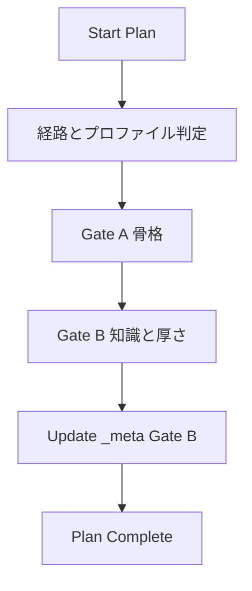
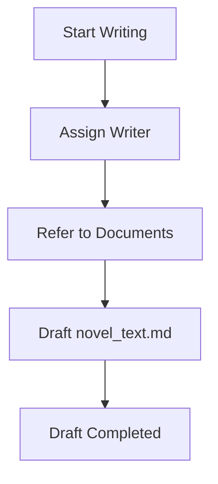
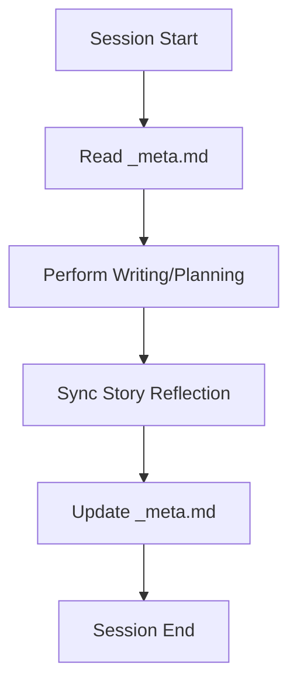
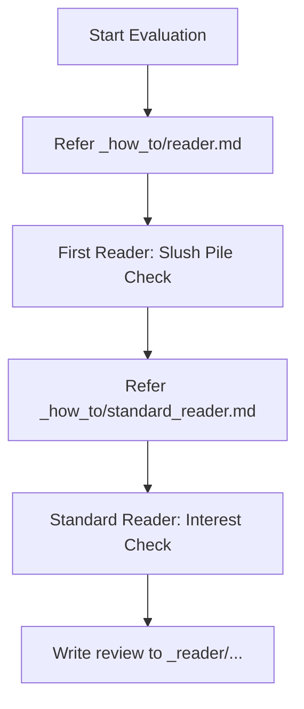
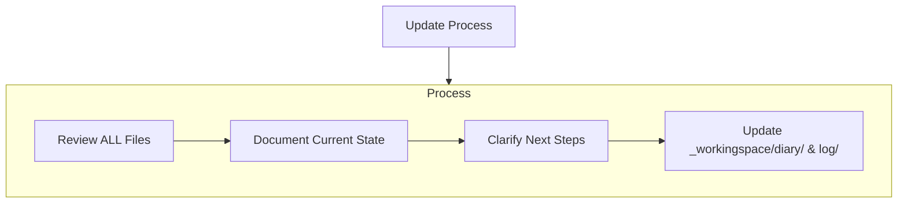

# Monogatari Coach ワークフロー詳細仕様

> このファイルは長いモード別仕様であり、常時規則ではない。作業の入口は root ルーターと該当スキルを優先し、必要なときにこの詳細仕様を参照する。

このファイルは、複数のルール・スキル・docs にまたがる概念の短い正本を置く。
長い例、コマンド、provider 別の詳細、トラブルシュートは `docs/` へ置く。

## METRON V1 導入手順

METRON の V1 自動修復を使うときは、次の順序を守る。

1. `SceneContract`、`BeatPlan`、本文アンカーと `_metron/<scene_id>/` の対応を確認する。
2. `config/metron_models.yaml` の対象モデルが `calibrated: true` で、`span_ratios` と `budget_ratios` を分離した承認済み閾値を持つことを確認する。未承認の設定で V1 判定へ進まない。
3. マーカー付き draft を `analyze` し、`metrics` / `spans` / `regression` を保存してから `classify` する。`GenerationTruncated` は自動修復しない。`TooShort` は分量バー（シーン `chars_floor`、Beat `chars_hint`）の未達であり、Deepen のみで自動修復する。
4. provider を接続する場合は、ユーザー承認済みのコールバックだけを `repair_scene()` へ注入する。METRON が認証情報を読み込んだり、承認なしに外部送信したりしない。
5. `BeatMissing` は単独再生成、計画下限未達の `BeatThin` と `TooShort` は Expand / Deepen、`EndingRush` は末尾 Beat の単独再生成とする。校正典型値だけの `BeatThin` は自動修復しない。EndingRush の末尾へ先に Expand を適用しない。`TooShort` を末尾再生成の根拠にしない。指示目標は床以上に出す。
6. 修復後は Beat マーカーを保持した連結校正を1回だけ行い、校正後の正規化本文を再計測する。元文残存率未達、校正による短縮、マーカー破損、Beat 順の入れ替え、同一本文の Deepen、新規文の同義反復は適用せず著者提示へ戻す。シーン `TooShort` は床に届くまで複数 Beat を Deepen する。
7. 採用稿を `FINAL.md` へ保存するときは Beat / fact マーカーを除去し、既存の `FINAL.md` を上書きしない。`FINAL.md` だけでは本文完了にしない。本文正本へ反映する場合、writing_bridge 経路は `publish`、従来経路は本文出力スキルの完了条件を満たす。

## CHRONOS P0 検査手順

CHRONOS の順序検査を使うときは、次を守る。

1. 作品フォルダに `chronos/` を置く（`python tools/chronos_cli.py init <作品>`）。既存の `chronos/` は上書きしない。
2. イベントは章単位 YAML に複数件収容する。必須は `id` と `title` のみ。日付は省略してよい。
3. `python tools/chronos_cli.py check <作品>` は循環制約を CHR001 として報告する。LLM は呼ばない。
4. 検査の副作用で `world.md` や `_novel_text` を書き換えない。挿絵・タグ YAML も書き換えない。
5. 執筆完了ゲートにはしない。P1 の STN・キャッシュ・watch、P2 の知識レイヤは未実装である。METRON の `chronos_span` は参考の両端だけとし、執筆接続は `writing_bridge_cli.py` が `links` で明示する。
6. 人物状態を使う作品だけ `chronos.config.yaml` の `character_state.dimensions` を宣言する。次元名と値は作品が付ける。`init` 雛形は次元なしのままにする。
7. 状態ありの check は CHR010（非法遷移）・CHR011（所在観測）・CHR013（未確定順序）を報告する。CHR012（挿絵 variant）は `rules.CHR012` と `illustration_bind` が揃ったときだけ走る。循環や CHR013 ではその人物の状態を捏造しない。

## 作品単位の METRON / CHRONOS / AUDIT_LOG フラグ

作品の config.md の「## 基本情報」表に METRON / CHRONOS / AUDIT_LOG 行を置き、値は大文字の ON / OFF だけにする。METRON / CHRONOS の行なしは OFF。AUDIT_LOG の行なしは ON。未知値・重複・読込失敗は設定エラーとする。新規起こしで行を書くときの既定は ON。作成時に確認し、返答がない場合は **「未応答・既定 ON」** と記録する。OFF はユーザー明示または清書中の一時停止などに限る。

フラグは自動ワークフローの起動判定にだけ使う。明示された metron_cli.py / chronos_cli.py / 査証ログ追記は config.md を見ず、OFFでも実行する。ONの検査結果は本文保存と分け、欠落・CLI失敗・CHR001を理由に本文完了を取り消さない。

METRON: ON では、既稿は契約・Beat・マーカー不足を「未計測／要対応」として残し、新規章は可能な範囲で契約・Beat・マーカー付き draft を用意して analyze する。CHRONOS: ON では、無ければ chronos/ を初期化し、既存イベントを check する。当該章のイベント手入力は推奨であり、P3の原稿自動抽出は行わない。AUDIT_LOG: OFF では `_workingspace/log/` への自動追記を行わない。日記は対象外である。ハッシュ一致の active run がある場面では、同じ版の analyze / check を重ねず `writing_bridge` の inspect に任せる。

## 執筆接続の起動判定

通常の執筆依頼（「続きを書いて」「この場面をDeepenして」「当該場面を保存して」）は、対象作品のフラグを読んで経路を一つにする。詳細手順はスキル `novel-text-file-output` / `novel-refinement-output` / `novel-story-reflection`。短い不変条件は `concepts.md` の「執筆接続（writing_bridge）」。

- 両方 OFF: writing_bridge run を作らない。本文は従来の `_novel_text` 直接更新。明示 CLI は拒否しない。
- METRON または CHRONOS が ON: 対象場面を確定し、ハッシュ一致の active run が無ければ `prepare`。検査は `receive` → `inspect`。同じ版へ `metron_cli.py analyze` / `chronos_cli.py check` を重ねない。
- Deepen / 局所修復: METRON ON かつ校正済みモデル。シーン床未達、必須修復残り、または `--intent explicit_deepen` のときだけ `repair-begin` → `repair-next` → 候補作成 → `repair-submit`。床到達かつ必須なしの `auto` は `REPAIR_NOT_NEEDED`。`--scope beats` は指定 Beat だけを Deepen する（`BeatMissing` は範囲外でも必須）。発行不能な必須、および適格候補ゼロの `escalated` は `repair-next` のあと `author_stop` で証跡を付けられる。pending job JSON 欠落は `STALE_EVIDENCE`。pending の破棄は `repair-finish`。この間は正本を触らない。修復が active のあいだ C1 未記録は報告して続け、完了後は未記録で止める。速度運用の詳細は `_workingspace/plans/20260912_metron-ops-speed.md`。
- 正本反映: `--allow-publish` の run だけ `publish --dry-run` のあと `publish`。起草用 run へ後付けしない。METRON ON の場面作業では追加の保存依頼を待たず、修復が terminal になったあと保存用の新 run へ進める。止めの明示があるときだけ止める。CHRONOS ON だけでは進めない。保存用は新 run で receive する。未作成または空の正本は selector なし。既存の非空本文だけ heading / scene アンカー / `append`。`inspect --from-run` は CHRONOS ON かつ起草 run に observations があり本文 hash が一致するときだけ。欠落は UNKNOWN_REF。CHRONOS OFF は `--from-run` を付けず C1 は skipped。CHRONOS ON は初回 inspect の前に observations を書き、C1 成功前に正本を書かない。引用座標の下書きは `locate-quote`。inspect と同じ版検証のあと一意一致だけを出し、重複は推測しない。ずれは `STALE_EVIDENCE`。手編集で置換しない。正本ではマーカー除去後の連続空行を段落1つ分に畳む。完了後は `novel-story-reflection`。`publish --dry-run` の句読点 fail は正本を書かない。dry-run の測定対象は `compose_published()` の保存予定全文。本番の句読点は結合後全文を `report.json` に記録し、失敗でも本文は戻さない。未達なら完了報告しない。`inspect` の required と advisory は分けて読む。保存案内は床到達・必須なしに加え、C1 が success または skipped、repair が active でないときに限る。
- 清書: `novel-refinement-output`。`publish` と重ねない。自動の再計測・イベント更新はしない。

## 自己発展型ルールガバナンス

定義:
**正本（Policy-as-Code）**を短い概念として固定し、**指示（Instruction-driven）**で運用を拡張しつつ、**機械検証**と**追記ログ**で「完了」を拘束して、再現可能に発展する運用方式。

## 正本と副本

定義:
正本は、判断・編集・検証の基準になる一次情報である。副本は、人間の確認、既存バッチ連携、入口生成物、表示用に使う派生情報である。

必須:

- 正本を更新できる状態では、副本だけを直接直して完了扱いしない。
- 副本を直した場合は、対応する正本へ反映してから再生成・再エクスポートする。
- どちらが正本か迷う領域では、作業前に既存ルール・スキルの「正本」節を確認する。

代表例:

| 領域 | 正本 | 副本・派生 |
|------|------|------------|
| ルール・スキル | `.rulesync/rules/`, `.rulesync/skills/` | `AGENTS.md`, `CLAUDE.md` |
| 創作技法雛形 | `_how_to.example/` | `_how_to/` のユーザー調整 |
| 操作説明 | `docs/` | チャット上の要約 |
| 小説本文 | `novels/<作品>/_novel_text/novel_text*.md` | チャット上の本文提示 |
| 書評・興味判定 | `novels/<作品>/_reader/*.md` | チャット上の要約 |
| キャラクタータグ | `novels/<作品>/tag/characters/*.yaml` | `tag/<romaji>.md` |
| 漫画ページ | `novels/<作品>/manga/pages/*.yaml` | `manga/manga_XX.md` |
| 挿絵計画 | `novels/<作品>/illustrations/plans/*.md` | `_meta.md` §3.2 章別割当表 |
| 挿絵ページ | `novels/<作品>/illustrations/pages/*.yaml` | `illustrations/illustration_XX.md` |

## タイトル命名ゲート（Plan Mode）

定義:
作品のタイトル命名は「なんとなく決める」ではなく、**候補生成→比較→採用→記録**を行い、再現可能にするための必須ゲートである。Plan Mode では **Gate B** の一部として扱う（企画完了の定義は `concepts.md`「Plan Mode の完了」）。

必須:

- 新規起こし、またはタイトル変更時は、タイトル候補を **最低 5 件**生成し、比較観点（内容想起・ジャンル伝達・固有性/検索性・読後の意味）で採否理由を付けて 1 件採用する。
- 採用タイトルは `proposal.md` と `config.md` の **作品名**に反映する。
- 不採用候補（2〜5件）と簡単な却下理由は、`config.md` の **「資料上の別名」**へ残す（作品名揺れのメモを兼ねる）。
- 既存作品で命名記録がすでにある場合は再抽選せず、記録の存在を確認して Gate B 記録に残す。

参照:

- 命名技法（雛形・基準）: `_how_to.example/naming.md`
- Plan Mode への組込み（Gate A / Gate B）: `.rulesync/skills/novel-planning/SKILL.md`

## NovelAI 向けタグ分離（パイプ区切り）

定義:
NovelAI での生成において、画風・品質タグ（ベース）とキャラクター固有タグを分離し、一貫性を高めるための形式である。

必須:

- 互換Markdown（`tag/*.md`, `manga_XX.md`）のタグ行では、`ベースタグ | キャラクタータグ` の形式を標準とする。
- `novel_prompt_ir_export_md.py` でエクスポートする際は、原則として `--novelai-pipe-tags` を付与する。
- パイプ `|` の前後はカンマ区切りとし、キャラクター固有の特徴（髪、目、衣装など）を後半に配置する。

参照:

- Markdown 互換層: `.rulesync/skills/novel-tag-md-format/SKILL.md`
- 漫画 IR: `.rulesync/skills/manga-prompt-ir/SKILL.md`
- ルール作成規約: `.rulesync/rules/rule-authoring.md`

## Tag Mode バリアント階層（000番台・100番台）

定義:
キャラクタータグの `prompt_variants` は **000番台（服装・衣装状態）** と **100番台（資料・ポーズ・紹介シート）** に分ける。漫画の `subjects[].variant_id` に使うのは **000番台のみ**（例: `001_normal`）。

必須:

- Tag Mode 完了時は、主要キャラごとに **`000_base`**（固定外見）と **000番台**（作品に必要な衣装状態）を `tag/characters/*.yaml` に書く。
- **`000_base.danbooru_tags` に性別トークン（`1boy` / `1girl` 等）を含める**。ルートの **`character_tags` フィールドは 2026-06 以降廃止**（移行: `tools/novel_prompt_ir_migrate_character_tags.py`）。
- **`000_base.danbooru_tags` には外見・体格・髪・目・肌・種族・固定小物を置く**。人物識別は **`character_id` / `name` / `name_en`（メタ情報）** で行い、**`danbooru_tags` に人名・キャラ名トークンを入れない**（`novel_prompt_ir_validate.py` が WARNING / `--strict-quality` で ERROR）。画像生成の **tag_csv**（`yaml_panel_tags`・挿絵バッチ含む）も人名を後付けせず、一致トークンを機械除外する（NovelAI pipe のキャラセグメント先頭名は別扱い）。
- **`solo` は継承用の `000_base` には載せない**。`000_base` は全バリアントへ合成されるため、`solo` を入れると `combines_with` 付き（複数人・結合資料の `103_*` / `104_*` 等）へも混入する。**`solo` が要るのはソロ資料バリアントのみ**（例: `100_intro` / `102_signature_pose` の `danbooru_tags`、または `000_base` ジョブ単体生成時の一時付与）。生成実行だけ付ける場合は `image_provider_novel_tag_batch.py` の `--prepend-tags solo` と `--variant-id` の組み合わせ可。
- **`000_base` は必須**（`novel_prompt_ir_validate.py` で欠落・空は ERROR）。
- **汎用100番台**（次節「汎用テンプレート」）は Tag Mode の標準成果物とする。
- **カスタム要素**（次節）は作品メタまたはユーザー指示に列挙したときだけ追加する。
- 100番を省略するときは当該バリアントの `description` または作品 `_meta.md` のキャラタグ方針に **省略理由**を残す。
- 100番台は **`combines_with`** で000番台の `variant_id` を指定する。互換 MD 出力は `novel_prompt_ir_export_md.py --novelai-pipe-tags` を用いる。

禁止:

- 000番台のみ作成して Tag Mode 完了扱いにしない（汎用100番を省略するときは理由を明示する）。
- 漫画 `variant_id` に `100_*` を指定しない。
- **`000_base`** および **固定合成経路**（次節「身体的正本」§3.1）へ **露出・性器・裸限定**の Danbooru タグを置かない。
- **`000_base.danbooru_tags` に `solo` を載せる**（継承先の複数人バリアントと矛盾させる）。
- **`prompt_variants[].danbooru_tags`** および **`appearance.distinctive_features` / `manga_rules.consistency_tags`** に **`character_id` / `name` / `name_en` と一致する人名トークン**を置く（`caption` / `translation` は人間向け説明として残してよい）。

参照:

- 身体的正本（3階層）: 本ファイル「Tag Mode 身体的正本（3階層継承）」
- 汎用／カスタムの正本: 本ファイル「Tag Mode 汎用テンプレートとカスタム要素」
- 入口ルール: `.rulesync/rules/overview.md` の条件別ルーティング（Tag / Manga）と本ファイルの当該節
- 型・手順: `.rulesync/skills/manga-prompt-ir/SKILL.md`
- 人間向け操作: `docs/workflow/instruction-driven.md`「G. キャラクター画像タグ」

## Tag Mode 身体的正本（3階層継承）

定義:
露出誘発タグを着衣バリアントから物理的に隔離する **SFW 固定 → 身体的正本（NSFW）→ 状況継承** の標準構造。000番台・100番台の帯分け（前節）に加え、**タグの注入経路**を次の3階層で固定する。

| 階層 | 定義名 | 必須条件 |
|------|--------|----------|
| **Level 1** | **固定外見（SFW）** | `000_base` は髪・目・肌・種族・固定小物など**服の上から不変**の特徴のみ。**露出・性器タグは原則禁止**。 |
| **Level 2** | **身体的正本（NSFW）** | **`006_nude`**（代表 ID）を裸の標準とし、`nude` および性器・秘部の詳細タグを**ここに集約**。NSFW を扱う作品でのみ必須（全年齢作品は省略可。省略理由を `description` または `_meta.md` に残す）。 |
| **Level 3** | **状況バリアント** | 裸を伴う状況は **`combines_with: 006_nude`**（または当該作品の身体的正本 ID）を必須とし、Level 2 を継承する。000番台 ID のまま付けてよい（漫画 `variant_id` 互換）。 |

### 固定合成経路の禁止事項（Level 1 と同格）

`appearance.distinctive_features` および `manga_rules.consistency_tags` は、漫画 batch の**主経路**（`character_ir_tags()`・`subjects[].variant_id` 指定時）では **`000_base` 優先のため合成されない**。一方 **副経路**（variant 未指定、`novel_prompt_ir_embed_snapshots`、`prompt_renderer` 等）では**状況に関係なく注入され得る**。いずれにせよ `000_base` と同様、次を **原則禁止**する。

- 性器・秘部の形状・状態タグ（裸／局部でないと意味が出ない Danbooru トークン）
- `nude` および局部を直接示すタグ

入れてよい例: 大きな手、敏感肌、翅なしなど**着衣時も成立する**特徴。身体的詳細のタグ列正本は **`006_nude` の `danbooru_tags`**（Level 2）。`character.md` に記述があっても、**生成タグとしては Level 2 にのみ**載せる。

必須:

- Tag Mode（NSFW 作品）では **`000_base` → 000番台（着衣）→ `006_nude`（該当時）→ 100番台** の順で `prompt_variants` を組み立てる。
- Level 3 の `combines_with` は、キャラ画像バッチと漫画バッチの両方で解決される（`tools/image_provider_novel_manga_batch.character_ir_tags` は `000_base` 優先＋`combines_with` 解決に揃える）。

禁止:

- 000番台（`001_normal` 等）の `danbooru_tags` に **裸露・性器タグを直接書く**（半脱衣装タグのみの `005_half_dressed` 等は除く）。裸露本体は **`006_nude` 経由**。
- `distinctive_features` / `consistency_tags` に **裸限定タグ**を置き、着衣コマへの漏洩経路を残す。

参照:

- 創作技法: `_how_to.example/tag.md`「身体的正本（3階層）」
- 検証: `tools/novel_prompt_ir_validate.py`（身体的正本ルールの WARNING / `--strict-quality`）

## Tag Mode 汎用テンプレートとカスタム要素

定義:

- **汎用テンプレート**: リポジトリ共通で、作品ジャンルに依存しない **固定の `variant_id` 集合**。本節の表が正本である。`_how_to/` の見出し・ファイル構成に依存しない。
- **カスタム要素**: **当該作品だけ**に必要な `prompt_variants`（特殊衣装、特殊資料ポーズ、ジャンル固有の局部・行為タグなど）。共有ルールでは **ID 名・部位・行為を固定しない**。採用は **作品 `_meta.md` のキャラタグ方針**（次節）またはユーザーの明示指示のみ。

分離の原則:

- エージェントは **汎用テンプレートを先に揃え**、カスタムは **列挙された分だけ**追加する。
- `_how_to/`（ユーザー調整の創作技法）の有無や章立てで、カスタムの要否や ID を推測しない。
- 他作品で使った `variant_id` を、別作品の共有必須としてコピーしない。

### 汎用テンプレート（正本一覧）

| 帯 | 必須 `variant_id`（代表） | 用途 |
|----|---------------------------|------|
| 固定基礎 | `000_base` | 髪・目・肌・種族・固定小物（衣装・姿勢・背景なし） |
| 000番台 | `001_normal` ほか | 衣装状態。漫画 `variant_id` に使う。**作品 `_meta.md` §4（漫画 variant 表）に載る ID はすべて YAML に存在させる** |
| 100番台 | `100_intro`, `101_turnaround`, `102_signature_pose` | 紹介・三面図・決めポーズの資料。`combines_with` 必須（平服資料は多くの作品で `001_normal`） |

000番台の追加は、**§4 の表・`character.md`・プロット**に登場する衣装に合わせる。水着・戦闘服・半脱等は作品ごとに ID を振る。**身体的正本**は多くの NSFW 作品で **`006_nude`**（前節 Level 2）。裸露タグは 000番台の着衣スロットではなく **`006_nude` に集約**する。

### カスタム要素（作品ごと）

| 項目 | 内容 |
|------|------|
| 正本 | 作品 `novels/<作品>/_meta.md` の **キャラタグ方針** 節（フィールド定義は次節） |
| 列挙 | キャラごとに `variant_id`（任意で `combines_with`・短い見出し） |
| 抽象例（IDは作品が命名） | 資料・局部を見せるポーズ（100番）、資料・接触ポーズ（100番）、ケア・治療用衣装（000番） |
| 語彙 | Danbooru 具体タグは **`character.md`** と作品 YAML。共有ルールに部位名・固定IDを書かない |

**テンプレート一式モードでも、カスタムは自動追加しない**（キャラタグ方針に列挙した分のみ）。

## Tag Mode 作品メタ（キャラタグ方針）

定義:
作品 `novels/<作品>/_meta.md` の **「画像・漫画生成設定」** 内に置く、Tag Mode の方針メモ。節番号（例: §6）は `_how_to.example/meta.md` と揃えてよいが、**ルール上の必須フィールドは本節**を正とする（`_how_to` の構造に依存しない）。

| フィールド | 値の例 | 意味 |
|------------|--------|------|
| **バリアント方針** | `標準` / `テンプレート一式` / `最小` | 省略の厳しさ（本ファイル「テンプレート一式」参照） |
| **カスタム要素** | キャラ別の `variant_id` リスト | 汎用外。空ならカスタムなし |
| **除外** | `variant_id` リスト | ユーザーが明示した除外のみ |

エージェントは Tag Mode 開始時に **当該作品の `_meta.md`** を読み、上記フィールドがあればそれに従う。

## Tag Mode テンプレート一式（裁量を抑える）

定義:
本ファイル **「Tag Mode 汎用テンプレート」** に列挙した `variant_id` を、エージェントの独自判断で省略せず YAML に書く Tag Mode の指示モード。カスタム要素は **作品メタに列挙された分のみ**追加する。

トリガー（いずれかで発動）:

- チャット: 「**テンプレート分はすべて作成**」「**標準テンプレート一式**」「**Tag Mode（テンプレート一式）**」「**tag テンプレ完備**」
- 作品 `_meta.md` の **バリアント方針** が **`テンプレート一式`**
- 本ファイル「Tag Mode」節および docs の「テンプレート一式」指示文テンプレ

必須（主要キャラごと）:

1. **汎用テンプレート**（`000_base`、`100_intro` / `101_turnaround` / `102_signature_pose`、`combines_with` 付き）。
2. **000番台**: 作品 `_meta.md` §4（漫画 variant 対応）の **`variant_id` をすべて** `tag/characters/*.yaml` に存在させる。
3. **カスタム要素**: 作品メタの **カスタム要素** に列挙した `variant_id` をすべて作る（テンプレート一式だけでは作らない）。
4. エクスポートは **`novel_prompt_ir_export_md.py --novelai-pipe-tags`**。

禁止（テンプレート一式モード時）:

- エージェントが独断で **汎用100（100〜102）** を省略すること（**除外** に列挙された ID のみ省略可）。
- 共有ルールに **ジャンル固有の固定 `variant_id`** を必須と書くこと。
- テンプレート一式と標準の省略規則が矛盾するときは、**直近のユーザー指示**と **作品 `_meta.md` のキャラタグ方針** を優先し、一言確認する。

参照:

- 汎用／カスタムの定義: 本ファイル「Tag Mode 汎用テンプレートとカスタム要素」「Tag Mode 作品メタ」
- 入口ルール: `.rulesync/rules/overview.md` の条件別ルーティング（Tag / Manga）と本ファイルの当該節

## 漫画IRと互換Markdown

定義:
漫画ページ・キャラクタータグの編集正本は YAML IR であり、`tag/<romaji>.md` と `manga/manga_XX.md` は YAML から出力する人間向け・既存バッチ向けの互換Markdownである。

必須:

- キャラクタータグの正本は `novels/<作品>/tag/characters/<character_id>.yaml` とする。
- 漫画ページの正本は `novels/<作品>/manga/pages/manga_XX_pYY.yaml` とする。
- 互換Markdownを手で直した場合は、対応する YAML IR へ戻してから再エクスポートする。
- Manga Tag Mode の初手として、`manga/manga_XX.md` だけを直接新規作成して唯一の正本にしない。
- 画像生成前の検証は YAML IR を中心に行い、必要に応じて互換Markdownを生成直前の確認先として使う。

役割:

| ファイル | 役割 |
|----------|------|
| `tools/manga_prompt_ir/schemas/*.py` | 型・必須項目の正本 |
| `tag/characters/*.yaml` | キャラクター外見・衣装・固定タグの編集正本 |
| `manga/pages/*.yaml` | ページ・コマ・人物・セリフ・構図の編集正本 |
| `tag/<romaji>.md` | キャラクタータグの可読副本・既存バッチ互換 |
| `manga/manga_XX.md` | 漫画 Step1 / Step2 の可読副本・既存バッチ互換 |

参照:

- Manga Prompt IR: `.rulesync/skills/manga-prompt-ir/SKILL.md`
- Manga Tag 品質ゲート: `.rulesync/skills/manga-tag-quality-gate/SKILL.md`
- 操作説明: `docs/image-generation/manga-prompt-ir.md`, `docs/image-generation/manga-tag-generation.md`

## 漫画互換Markdownの完了条件

定義:
`novels/<作品>/manga/manga_XX.md`（Step1 / Step2 の互換副本）を新規作成・更新したと報告してよいのは、**`tools/novel_prompt_ir_export_md.py` が書き出したファイル**であり、チャットやエージェントの **Write だけで Step1/Step2 全文を組み立てた状態**ではない。

必須:

- YAML IR 正本（`manga/pages/*.yaml`）を更新してからエクスポートする。
- `tools/novel_prompt_ir_validate.py` で検証し、`tools/novel_prompt_ir_export_md.py` でエクスポートする。
- エクスポート直後に `Read` でヘッダ・IR正本・Step1/Step2 の構造を確認してから完了報告する。
- 更新パス（`manga/manga_XX.md`）と IR 正本の YAML パスを添えて完了を伝える。

禁止:

- チャットや Write だけで `manga/manga_XX.md` を新規・全面更新して互換出力完了としない。
- YAML を更新しないまま互換 Markdown だけを直して Manga Tag Mode を完了扱いにしない。
- `novel_prompt_ir_export_md.py` の実行と `Read` による確認の前に「エクスポートした」と述べない。

参照:

- 実行手順（コマンド・フラグ詳細）: `.rulesync/skills/novel-manga-md-output/SKILL.md`
- 操作説明: `docs/image-generation/manga-prompt-ir.md`

## Manga Tag Mode ワークフロー

定義:
Manga Tag Mode は、小説本文とキャラクター正本から漫画ページ YAML IR を作り、検証し、必要に応じて互換Markdownや画像生成へ進める作業である。

必須:

1. 本文正本とキャラクター正本を確認する。
2. 作品 `_meta.md` の §4（TPO → variant 対応表）と §5（漫画タグ層）を区間ごとに合意する（書き方は `_how_to.example/meta.md` を正とする）。
3. `manga/pages/*.yaml` を作成・更新する（§5 常時タグの転記漏れには `tools/novel_manga_apply_tag_defaults.py --apply` を使う）。`panels[].summary` があるコマは **「Manga `summary_en` の翻訳経路」** に従い `summary_en` + `summary_en_source` を揃える。
4. 品質ゲートで確認し、`tools/novel_prompt_ir_validate.py`（本番前は `--strict-quality`）で検証する。
5. 互換 Markdown が必要なときだけ `tools/novel_prompt_ir_export_md.py` で再エクスポートする。
6. 画像生成は「画像生成: dry-run から本番まで」に従う。

禁止:

- 互換 Markdown だけを新規作成・修正して Manga Tag Mode 完了扱いにしない。
- 生成前検証を YAML IR ではなく、互換 Markdown だけで済ませない。

参照:

- 詳細手順: `.rulesync/skills/manga-prompt-ir/SKILL.md`
- 品質ゲート: `.rulesync/skills/manga-tag-quality-gate/SKILL.md`
- 操作説明: `docs/image-generation/manga-prompt-ir.md`

## Manga `summary_en` の翻訳経路

定義:
漫画ページ IR の `panels[].summary`（日本語・編集用）に対応する英語1文 `panels[].summary_en` の付与方法。`location_en` / `pose_action_en` 等と同様、**エージェントが YAML 保存時に英語行を埋める**のを主経路とする。`summary_en_source` は翻訳時点の `summary` 原文を記録し、鮮度追跡の正本とする。

必須（主経路）:

1. `summary` を書いたコマでは、同ターンで **`summary_en`（英語1文）** と **`summary_en_source`（= そのときの `summary` 原文）** を YAML に書く。
2. `python tools/novel_prompt_ir_validate.py novels/<作品> --strict-quality` で検証し、**exit 0** を `summary_en` 完了の機械判定とする（欠落・CJK・鮮度不一致はエラー）。
3. `summary` のみ直したときは **`summary_en` も更新**するか、validate の鮮度エラーに従って直す。

任意（従経路）:

- `python tools/novel_manga_panel_summary_en.py novels/<作品>` — エージェントなし編集・一括再翻訳・CI 向け。`.env` の `MONOCRI_SUMMARY_EN_*` と Chat API キーが必要。**Manga Tag Mode 完了の前提にはしない**。

省略:

- NovelAI コマ生成で `summary_en` を載せないときは `MONOCRI_MANGA_STEP1_INCLUDE_PANEL_SUMMARY=0` または `--no-include-panel-summary`。`--strict-quality` で `summary_en` を必須にするかは作品運用で決める（省略時は作品 `_meta.md` に理由を残す運用可）。

禁止:

- `OPENAI_API_KEY` 未設定を理由に Manga Tag Mode 全体を止める扱いにしない（翻訳ツール未実行は主経路ではブロッカーではない）。
- エディタでの漫然たる英語入力（`summary_en_source` なし・validate 未確認）で完了扱いにしない。

参照:

- スキル: `.rulesync/skills/manga-prompt-ir/SKILL.md`（`panels[].summary_en` 節）
- 検証実装: `tools/manga_prompt_ir/summary_en.py` の `summary_en_quality_issues`
- 操作説明: `docs/image-generation/manga-prompt-ir.md`（`summary_en` 節）

## 挿絵計画（Illustration Plan Mode）

定義:
挿絵計画は、本文執筆後・YAML IR 作成前に行う **Step 1**。章ごとに 0枚／1枚／複数枚を決め、候補3点・採用・本文アンカー・衣装 variant を計画 MD に記録する。表紙（`illustration_00` 帯）は章挿絵とは**別枠**として管理する。

必須:

- 挿絵計画の正本は `novels/<作品>/illustrations/plans/` 配下の Markdown とする（表紙: `cover_plan.md`、章: `chapter_plan.md`）。
- **`_meta.md` §3.2 章別割当表**が章ごとの枚数・位置の正本。YAML より先に §3.2 を更新する。
- 計画 MD を経由せず YAML だけを作成して Illustration Tag Mode を完了扱いにしない。
- 章が 0枚のとき: YAML を作らない。計画 MD に「0枚＋理由」を書いた状態が Step 1 の完了条件。
- 表紙は §3.2 章別割当表に載せない（§3.1 と `cover_plan.md` で独立管理）。

参照:

- 創作技法雛形: `_how_to.example/illustration_plan.md`
- Illustration Plan スキル: `.rulesync/skills/illustration-plan/SKILL.md`

## 挿絵IR

定義:
挿絵IRは、小説本文から漫画ではない一枚絵・章扉・表紙などを作るための YAML IR である（**Step 2**）。型は漫画ページIRと同じ `MangaPagePrompt` を使い、`meta.intent: illustration` で用途を区別する。**計画 MD（Step 1）で採用が確定した IR だけ**作成する。

必須:

- 挿絵ページの正本は `novels/<作品>/illustrations/pages/illustration_XX_pYY.yaml` とする。
- Illustration Tag Mode 開始前に必ず `_meta.md` §3.2 と `illustrations/plans/chapter_plan.md`（または `cover_plan.md`）を読む。
- `panels[]` は漫画のコマではなく、構図を分解する構成セルとして扱う。単体挿絵は1セル、群像・複合構図は複数セルを許容する（複合構図の判断・生成方針は本ファイルの Illustration Tag Mode）。
- 既定は枠線なし・パネル境界なしの一枚絵とし、枠を使う場合は `manga.panel_layout` または `render_instruction.user_directives.page_notes` に意図を明記する。
- セリフ・効果音などの `text` は原則空にする。画像内文字が必要な場合だけ理由と配置を明記する。
- 画像保存先は `novels/<作品>/illustrations/_assets/illustration_XX/` とする。
- 検証は `tools/novel_prompt_ir_validate.py` で行い、画像生成は dry-run から本番までの手順に従う。

禁止:

- 計画 MD（Step 1）を経由せず YAML だけを新規作成して Illustration Tag Mode を完了扱いにしない。
- 章が 0枚と決まっている場合に YAML を作成しない。

役割:

| ファイル | 役割 |
|----------|------|
| `_meta.md` §3〜§3.2 | 方針・表紙・章別割当の正本 |
| `illustrations/plans/cover_plan.md` | 表紙計画の正本（Step 1） |
| `illustrations/plans/chapter_plan.md` | 章挿絵計画の正本（Step 1） |
| `illustrations/pages/*.yaml` | 挿絵・表紙の実行正本（Step 2） |
| `illustrations/_assets/<illustration_XX>/` | 挿絵・表紙画像の保存先 |
| `illustrations/illustration_XX.md` | 任意の可読副本・外部連携用 |

参照:

- Illustration Plan スキル: `.rulesync/skills/illustration-plan/SKILL.md`
- Illustration Prompt IR: `.rulesync/skills/illustration-prompt-ir/SKILL.md`
- 操作説明: `docs/image-generation/illustration-prompt-ir.md`

## Illustration Tag Mode 作品メタ（挿絵・表紙）

定義:
作品 `novels/<作品>/_meta.md` の **「III. 画像・漫画生成設定」§3〜§3.2** に置く、挿絵専用の方針メモ。漫画の §4 variant 表・§5 タグ層と同型の責務分離で管理する。

| 節 | 内容 |
|----|------|
| **§3 方針** | 挿絵密度方針・章あたり既定枚数・1枚時の既定位置・候補数・優先場面・除外条件・計画正本パス・IR 番号設計 |
| **§3.1 表紙** | 表紙の有無・比率・計画正本・採用IR・計画状態・**題字方針**・題字ロゴ状態（別枠・§3.2 に混在させない） |
| **§3.2 章別割当表** | 章ごとの 0/1/multiple・位置・優先シーン・計画／YAML／生成の進捗状態 |
| **§7 出版パッケージ進捗** | book / rights / cover.yaml / lock / interior / reader-proof / preflight（完成目安） |

必須:

- Illustration Plan Mode 開始時に必ず `_meta.md` §3〜§3.2 を読む。
- §3.2 の「枚数」列が章ごとの 0/1/multiple の正本。計画 MD と矛盾するときは、**直近のユーザー指示 → §3.2 表 → §3 方針フィールド** の順で優先する。
- 表紙は §3.1 と `cover_plan.md` で管理し、§3.2 の表には載せない。
- フィールド定義の詳細は `_how_to.example/meta.md` §3〜§3.2・§7 を参照する。

## 表紙合成と題字（Cover Composition）

定義:
表紙**絵**（`illustration_00`）と題字・クレジットは分離する。配置の正本は作品直下の **`cover.yaml`**。書誌の意味情報は **`book.yaml`**。

必須:

- 表紙絵にタイトル文字を焼かない（原則）。後載せは `cover.yaml` の layers。
- **原則（既定）**: 題字ロゴは指定がない限り**横書き（`horizontal`）タイトル主体**（ライトノベル等の現代商業スタイル）を基本とし、作品の世界観・トーン・キーアイテム・カラー情報をAI発注文（`title_logo_order.yaml`）へ引き渡してデザインさせる。
- **題字方針**は `_meta.md` §3.1 で先に決める: `組版`（`type: text`）／`logo_asset`（`cover/assets/title_logo.png` 等）／`後回し`。
- 方針が `logo_asset` のとき: `cover/title_logo_plan.md` →（任意で）`title_logo_order.yaml` → 生成 → 採用 asset → `cover.yaml` の title を `logo_asset` に差し替え → `rights.yaml` 登録。
- 方針が `組版` のとき: title レイヤーは `type: text` のままで題字完了とみなせる（題字ロゴ状態は `—`）。
- export 前に `book_cover_review.py`（または publishing review）で cover／権利を確認する。
- 印刷包み表紙（表1・背・表4）と EPUB は本節の完了条件に含めない。到達点は `interior.pdf` と `reader-proof.pdf`（layered cover）。

禁止:

- `illustration_00` だけを「題字込み表紙完成」として完了扱いにしない。
- 題字方針を決めないまま logo と組版を二重に載せない。

参照:

- 雛形: `_how_to.example/publishing/`
- 操作: `docs/workflow/cover-composition.md`
- スキル: `.rulesync/skills/title-logo-plan/SKILL.md`、`.rulesync/skills/novel-cover-layout/SKILL.md`

## 出版完成目安（Publication Gate）

定義:
紙・電子の閲覧用 proof までを、作品 `_meta.md` **§7 出版パッケージ進捗**で追う完成ゲート。`_meta.yaml` は画像バッチ用であり、出版チェックの正本にしない。

必須（一区切り）:

1. 表紙絵: §3.1 計画状態が `生成済`（または表紙 `なし`＋理由）
2. 題字: §3.1 題字方針が `組版` または `logo_asset` で、`cover.yaml` に対応レイヤーがあり cover review が通る
3. `rights.yaml` に表紙／ロゴ素材が登録されている（販売前の confirmed は別ゲート）
4. `book.lock.yaml` が現行入力と一致する
5. `_publication_output/<build-id>/` に `interior.pdf` と `reader-proof.pdf` があり preflight errors 0
6. `_meta.md` §7 が上記と同期している

参照:

- Phase 1: `docs/workflow/publishing-package.md`
- Phase 2A: `docs/workflow/paper-proof-export.md`
- 表紙合成: `docs/workflow/cover-composition.md`

## 画像保存先

定義:
生成画像は、作品フォルダ内の用途別ディレクトリに保存し、後から本文・タグ・漫画ページと対応を追える状態にする。

必須:

- キャラクター画像は `novels/<作品>/tag/<romaji>/` に保存する。
- 漫画ページ・コマ画像は `novels/<作品>/manga/_assets/<manga_XX>/comic/` に保存する。
- 漫画の背景資料画像は `novels/<作品>/manga/_assets/<manga_XX>/backgrounds/` に保存する。
- 挿絵・表紙画像は `novels/<作品>/illustrations/_assets/<illustration_XX>/` に保存する。
- コマ画像はファイル名接頭辞でページ・コマを区別する。例: `manga_01_p02_k03`。
- ページ単位サブフォルダ（`p01/`, `p02/` など）は既定・推奨にしない。必要な場合だけ任意で使う。

参照:

- 画像レイアウト: `.rulesync/skills/novel-image-layout/SKILL.md`
- 画像生成: `.rulesync/skills/forge-txt2img/SKILL.md`
- 操作説明: `docs/image-generation/index.md`

## `_how_to/` と `docs/`

定義:
`_how_to/` は創作技法を扱う準ルール領域であり、`docs/` は人間向けの操作マニュアルである。

必須:

- ツールの操作手順、コマンド例、provider 設定は `docs/` に置く。
- 小説文法、漫画作法、タグ語彙、書評観点は `_how_to.example/` またはユーザー調整領域の `_how_to/` に置く。
- LLM が `_how_to/` を恒久的に更新するのは、ユーザーが明示した場合に限る。

参照:

- docs 記述ルール: `.rulesync/rules/docs-writing.md`
- `_how_to/` の説明: `docs/project-structure/how-to-area.md`

## 共有ツールとユーザ用 Python（`tools/` と `_how_to/tools/`）

定義:
リポジトリ直下の **`tools/`** は**共有・正規運用**の公式スクリプトの置き場である。**`_how_to/tools/`** は **`_how_to/skills/` に付随するユーザワークフロー**用の Python を置く領域であり、ユーザーが保守する。

必須:

- **`.rulesync/skills/<skill_name>/` には Python を置かない**（`SKILL.md`・`MIGRATION.md` など Markdown のみ）。公式スキルが Python を要するときは **`tools/`** に実装する。
- **`_how_to/skills/<名前>/SKILL.md`** とセットで動かす**個人・試行ワークフロー固有の変換・補助スクリプト**は **`_how_to/tools/`** に置く。`SKILL.md` からは `_how_to/tools/<script>.py` を参照してよい。
- **`_how_to/tools/` のスクリプトをリポジトリ全体の既定前提として扱わない**。CI・必須チェック・全作品共通の手順に組み込む場合は、意図を整理したうえで **`tools/`** へ昇格するか、公式スキルとして再配置する。
- **短命の試行**は引き続き **`tools_temp/`** を使う（`_how_to/tools/` は、運用上わりと長く残すユーザスクリプト向け）。

参照:

- ローカル試行: ルート `readme.md` の「ローカル試行用」、`tools_temp/README.md`
- 入口ルールの詳細: 本ファイルの「共有ツールとユーザ用 Python（`tools/` と `_how_to/tools/`）」

## 公式スキルとユーザスキルの接続

定義:
**公式スキル**（`.rulesync/skills/`）はエージェントの既定動作として参照される。**ユーザスキル**（`_how_to/skills/<名前>/SKILL.md`）はユーザー領域の手書き手順であり、公式 agent skill ではない。ただし、公式スキル側に **発動条件** が書かれている場面では、エージェントはユーザスキルを読んでよい／読むべきとする。

必須:

- ユーザスキルの入口は **`_how_to/skills/_index.md`**（発動条件つき索引）。全ファイルを毎回読む運用にはしない。
- 該当条件がある場合のみ、公式スキル（例: **novel-planning**、**novel-character-profile**）から `_how_to/skills/` を参照する。
- ユーザスキルに付随する Python は **`_how_to/tools/`** に置く（本ファイル「共有ツールとユーザ用 Python」）。
- 恒久的・全作品必須になった場合のみ、別計画で `.rulesync/skills/` への昇格を検討する。

代表例（発動条件）:

- **選定レジストリ（Pick Registry）** の `list_id` を、profile・作品メタ・ユーザー指示で選び、抽選は **`tools/novel_pick_registry.py`**（スキル **content-pick-registry**）を正とする。
- **visibility: user** の list_id（`mature_*` 等）は **`_how_to/pick_registry/`** にのみ定義する。公式ルール・docs には具体 ID を列挙しない。
- ユーザスキル完全版の索引は **`_how_to/skills/_index.md`**。発動条件に当てはまるときだけ該当 `SKILL.md` を読む（全件必読ではない）。

lint / check 側では、`character_checklist.yaml` の profile に **`suggested_pick_lists`**（任意）と **`suggested_skill`**（任意・ユーザ領域のパス文字列）を載せ、`tools/novel_character_md_check.py` が HINT として再案内できる（skill パスは checklist の文字列をそのまま表示する）。

禁止:

- チャットでユーザスキルを明示したときだけ読む、と公式スキルが縛る記述を残さない（条件付き参照を優先する）。
- `_how_to/skills/` の全ファイルを Plan Mode 開始時に必読扱いにしない。

参照:

- 索引: `_how_to/skills/_index.md`
- 操作説明: `docs/workflow/user-skills.md`
- 人物プロフィール: `.rulesync/skills/novel-character-profile/SKILL.md`
- 選定レジストリ: `.rulesync/skills/content-pick-registry/SKILL.md`

## 選定レジストリ（Pick Registry）

定義:
**list_id** ごとに「どの JSON のどの path から何を引くか」を宣言的に登録する横断機構。キャラクター profile 向け（命名・口調候補等）とストーリー／トロープ向け（フック・進行）を同じ CLI 思想で扱う。

必須:

- 正本（雛形）: **`_how_to.example/pick_registry/`**（`public` のみ。`mature.yaml` は載せない）
- ユーザ運用: **`_how_to/pick_registry/`**（`mature.yaml` 等・visibility: user）。**`_how_to/*` は原則 Git 管理外**（`howto_init.py` でローカル生成）のため、clone に `mature.yaml` が無いのは欠落ではなく **ユーザ fragment 未配置** を意味する
- user fragment テンプレ: **`_how_to.example/pick_registry/mature.yaml.example`**（コピー先: `_how_to/pick_registry/mature.yaml`）。有効化手順の正本は同ディレクトリ **`README.md`**
- 作品別（任意）: **`novels/<作品>/pick_registry/work.yaml`**（`_meta.md` 自動連携は未設計。CLI `--novel` フックのみ）
- マージ: 各 `_index.yaml` の **`merge_order`** に従い後勝ち。`list_id` は横断で一意
- 低レイヤ抽選: **`tools/json_weighted_pick.py`**（スキル **weighted-pick**）
- list_id 解決・運用: **`tools/novel_pick_registry.py`**（スキル **content-pick-registry**）
- mature 向けボディー一括抽選: **`_how_to/tools/novel_character_pick.py`**（registry の `tool: novel_character_pick` から委譲）

禁止:

- 公式 `.rulesync/skills/` に `episode_mature.json` の path や mature 固有スキル名を代表例として直書きしない
- 計画 MD を経由せず、visibility: user の list_id だけを公式 docs の手順例に載せない

参照:

- スキル: `.rulesync/skills/content-pick-registry/SKILL.md`
- trope JSON 雛形: `_how_to.example/episode/general/episode_general.json`、`_how_to.example/episode/common/episode_common.json`
- 操作: `docs/tools/index.md`

## 画像生成: dry-run から本番まで

定義:
画像生成は、課金・画風・保存先・provider 差異を伴うため、必ず計画確認を挟む。

必須:

1. `.env` と `config/image_generation.json` で provider と設定を確認する。
2. `--dry-run` で provider、モデル、ジョブ数、保存先を確認する。
3. dry-run 結果をユーザーに提示し、明示承認を得る。
4. 承認後にのみ `--dry-run` なしで本番実行する。
5. 本番後、dry-run で示した保存先に画像ファイルが存在することを確認してから完了報告する。

禁止:

- dry-run の提示前に本番実行しない。
- ユーザー承認前に「続けて本番まで」進めない。
- 保存先のファイル確認前に「生成完了」と言わない。

参照:

- 画像生成スキル: `.rulesync/skills/forge-txt2img/SKILL.md`
- 操作説明: `docs/image-generation/index.md`

## キャラ／漫画タグ生成時マスク（置換／除外）

定義:
作品 `_meta.yaml` の `character_tag_batch` / `manga_tag_batch`（および CLI）で、生成直前の positive タグを **置換（replace）・除外（omit）** するレイヤ。YAML IR 正本は書き換えない。

必須:

- キャラ画像は `tools/image_provider_novel_tag_batch.py` の compose 後に適用する（適用順: replace → omit）。
- 漫画コマ（`step1-panels`）は `tools/image_provider_novel_manga_batch.py` でタグ組み立て後に適用する。`manga_tag_batch` が無ければ `character_tag_batch` の omit/replace を下敷きにする。
- dry-run で置換・除外を確認してから本番する。

禁止:

- マスクのためだけに `tag/characters/*.yaml`・`manga/pages/*.yaml`・互換 Markdown を一括書き換えして完了扱いにしない。

参照:

- 実装: `tools/tag_prompt_mask.py`
- 操作: `docs/tools/index.md`（tag batch / manga batch）
- 設計: `_workingspace/plans/20260724_character-tag-masking.md`

## 画像生成失敗時の provider 切替

定義:
dry-run 承認は、その provider と設定で実行する承認であり、別 provider への自動切替承認ではない。

必須:

- HTTP 429 / 403 / 5xx などで失敗した場合は、provider 名、エラー、対象ジョブまたは範囲を報告する。
- 待つ、provider を変える、範囲を絞るなどの選択肢を提示し、ユーザーの明示指示を待つ。

禁止:

- 別 provider へ自動で切り替えて再実行しない。
- 失敗した provider の承認を、別 provider の本番承認として扱わない。

参照:

- 画像生成スキル: `.rulesync/skills/forge-txt2img/SKILL.md`

## 完了扱い条件

定義:
「完了」は、成果物が正本または保存先に実在し、確認が済んだ状態だけを指す。

執筆:

- 正本 `novels/<作品>/_novel_text/novel_text*.md` に書き込む。
- 書き込み後、再読込または `tools/novel_char_count.py` で確認する。
- 確認後に、更新ファイルパスを添えて完了報告する。
- チャットに本文を出しただけでは完了ではない。

画像生成:

- ユーザー承認後に本番実行する。
- dry-run で示した保存先に画像ファイルが存在することを確認する。
- 確認後に、保存先を添えて完了報告する。

漫画互換Markdown（`manga/manga_XX.md`）:

- `tools/novel_prompt_ir_export_md.py` で出力する（詳細は上記「漫画互換Markdownの完了条件」）。
- エクスポート後に `Read` でヘッダ・IR正本・Step1/Step2 の構造を確認する。
- チャットや Write だけで互換 MD を書いた状態では完了ではない。

参照:

- 本文出力: `.rulesync/skills/novel-text-file-output/SKILL.md`
- 漫画互換 Markdown: `.rulesync/skills/novel-manga-md-output/SKILL.md`
- 清書出力: `.rulesync/skills/novel-refinement-output/SKILL.md`
- 画像生成: `.rulesync/skills/forge-txt2img/SKILL.md`

## 評価出力の保存先

定義:
下読み・書評・一般読者の興味判定・読み進み感想は、チャット上の本文ではなく、作品フォルダの `_reader/` に保存したファイルを正本とする。**First Reader は足切りゲートであり**、G1（冒頭）／G2（章完）／G3（全文）の3段階で運用する。**Reader Walk は採点せず、既読場面の感想を追記する。既定は未読の残り全部、要望があれば指定範囲だけ。**

必須:

- First Reader の書評は `novels/<作品>/_reader/YYYYMMDD_HHMM.md` に保存する。
- Interest Check の結果は `novels/<作品>/_reader/interest_YYYYMMDD.md` に保存する。
- Reader Walk は一つのセッションにつき `novels/<作品>/_reader/walk/<session_id>/` を作り、その中の `journal.md` を感想正本、`state.md` を到達位置とする。定量化を有効にした場合は、評価点ではない反応メタデータを同じ `journal.md` に追記し、完了前に `tools/novel_reader_walk_check.py` で検証する。`reaction_trace.*` はセッションディレクトリ内の生成物とする。`walk/` 直下の旧形式は移行時だけ `--legacy-root` で扱う。
- チャットには判定、短い理由、改善ポイントの要約だけを返す。**ただし Reader Walk は除く。** Reader Walk は進めた範囲と通しの感想要約だけを返し、判定・点数・改善ポイントは出さない。
- 書評観点は `_how_to/reader.md`、興味判定のペルソナ・第一印象は `_how_to/standard_reader.md`、読み進みの書き方は `_how_to/reader_walk.md`（無ければ `_how_to.example/reader_walk.md`）を参照する。
- 保存したファイルパスをチャットで明示してから完了扱いにする。
- **足切り判定は100点閾値を優先する**（70点以上: 読むべき / 55〜69点: 強い美点1つ以上なら読むべき / 54点以下: 読まなくていい）。閾値の定義と6項目の配点は `_how_to.example/reader.md` を参照する。
- **ゲート段階（G1/G2/G3）によってファイル名を変えない**。`_reader/YYYYMMDD_HHMM.md` を足切り・下読み兼用とし、段階はファイル内のヘッダに明記する。

禁止:

- チャットに書評本文を出しただけで、評価完了としない。
- `_workingspace/log/` を作品ごとの書評本文の保存先にしない。査証ログには作業事実だけを追記する。
- 5段階評価だけを根拠に足切り判定を行わない（100点換算で閾値を確認してから判定する）。
- 読み進みで作品評価点・改善点リスト・未読ネタバレを書かない。定量化時の反応強度・継続意欲は評価点ではなく `journal.md` の記録として扱い、チャットには出さない。チャットに感想だけ出して `walk/` へ追記しない完了をしない。

参照:

- 評価出力スキル: `.rulesync/skills/novel-reader-output/SKILL.md`
- 読み進みスキル: `.rulesync/skills/novel-reader-walk/SKILL.md`
- 操作説明: `docs/workflow/reader-output.md`、`docs/workflow/instruction-driven.md`

## 評価ファイル命名と役割（全モード一覧）

定義:
評価モードごとに異なるファイル名を使い、保存先と完了条件を `_reader/` に統一する。

| モード | 技法正本 | ファイル名 | 100点の意味 | 典型タイミング |
|--------|----------|-----------|-------------|----------------|
| First Reader（足切り） | `_how_to/reader.md` | `_reader/YYYYMMDD_HHMM.md` | 6項目100点（足切り用） | G1冒頭/G2章完/G3全文 |
| Interest Check | `_how_to/standard_reader.md` | `_reader/interest_YYYYMMDD.md` | なし（合格/不合格） | 企画・第1章・投稿前 |
| Editor Score | `_how_to/editor_score.md`（予定） | `_reader/score_YYYYMMDD_HHMM.md` | 5項目100点（深掘り用） | 足切り通過後・推敲後 |
| Consistency Audit | `_how_to/consistency_audit.md`（予定） | `_reader/consistency_YYYYMMDD.md` | なし（表形式） | 複数章完成後 |
| Synopsis（前処理） | `_how_to/novel_synopsis_for_review.md`（予定） | `_reader/synopsis_YYYYMMDD.md` | なし | 長文G3/Editor Score前 |
| Reader Walk（読み進み） | `_how_to/reader_walk.md` | `_reader/walk/<session_id>/journal.md`（状態は同じセッションディレクトリの `state.md`） | なし（感想＋任意の反応メタデータ。作品評価点なし） | 既定は未読の残り全部。要望があれば指定範囲 |

必須:

- ファイル名はモードごとに上表を参照し、既存名に勝手に接尾辞を追加しない。
- `_reader/YYYYMMDD_HHMM.md`（First Reader）は足切り・下読み兼用とし、G1/G2/G3 段階によってファイル名を変えない。
- Reader Walk は `_reader/walk/` 配下に固定し、First Reader の日時ファイルと混ぜない。
- 「予定」技法は対応するファイルが存在するまで、そのモードは実行しない。

参照:

- 保存手順: `.rulesync/skills/novel-reader-output/SKILL.md`
- 読み進み手順: `.rulesync/skills/novel-reader-walk/SKILL.md`
- 深掘り評価手順（予定）: `.rulesync/skills/novel-evaluation-output/SKILL.md`
- 操作説明: `docs/workflow/reader-output.md`

## 足切りと深掘り評価の住み分け

定義:
First Reader（足切り）と Editor Score（深掘り）は配点・目的が異なる別モードであり、混同しない。

| 観点 | First Reader（足切り） | Editor Score（予定・深掘り） |
|------|------------------------|------------------------------|
| 目的 | 読む／読まないの選別 | どこを直すと何点上がるか |
| 技法正本 | `_how_to/reader.md` | `_how_to/editor_score.md`（予定） |
| 配点 | 冒頭20＋キャラ20＋プロット20＋文章15＋わかりやすさ10＋独創15 | 構造20＋キャラ20＋文体20＋世界観20＋完成度20 |
| 閾値 | 70 / 55–69（美点）/ 54 | 点数は参考。致命弱点の優先順位が主 |
| 入力 | 対象章〜全文（短め） | あらすじ＋全文 or 重要章（長文多段） |
| 実行条件 | 任意のタイミング | 足切り通過後を推奨 |

必須:

- 「Editor Score で足切りする」「足切り点数で深掘り改善する」という混用をしない。
- 両モードを同一セッションで行う場合、先に足切り（First Reader）を完了してから Editor Score へ進む。
- ジャンル別編集者ペルソナは、Phase 1 では `config.md` のジャンル参照のみとする（専用 persona ファイルは Phase 2 以降）。

## 長文評価の閾値と前処理

定義:
作品全体（G3）または Editor Score で長文を一括評価することが困難な場合、Synopsis（あらすじ）を先行して作成し、段階的に評価を進める。

必須:

- 作品合計 **30,000字超**、または章単体 **8,000字超** の場合は、G3 全文足切り・Editor Score の前に Synopsis 先行を推奨する（P2 実装後は必須）。
- Synopsis の書式は `_how_to/novel_synopsis_for_review.md`（予定）に従う。ファイルが未作成の間は、400字程度の客観的あらすじをチャット内で作成してから評価を進めてよい。
- 章分割評価（文字数加重平均）の手順は `.rulesync/skills/novel-reader-output/SKILL.md` の「長文 G3 の分割評価」節を参照する。

参照:

- 長文パイプライン手順: `.rulesync/skills/novel-evaluation-output/SKILL.md`「長文多段パイプライン」
- 設計根拠: `_workingspace/plans/20260608_novel-evaluation-enhancement.md` Phase 2

## 評価作業一時領域（`_reader/_work/`）

定義:
30,000字超の長文評価や章分割評価で生じる中間作業ファイル（章別スコアノート・集計メモ等）を置く一時領域。`_reader/` 直下の最終成果物と混在させない。

必須:

- `_reader/_work/<YYYYMMDD>/` を評価セッションの作業フォルダとする（`YYYYMMDD` は評価実施日）。
- **最終成果物のみ** `_reader/` 直下に置く（命名は「評価ファイル命名と役割」の表に従う）。
- 作業フォルダ内の標準ファイル:
  - `ch01_eval.md`〜`chNN_eval.md`: 章ごとのスコアノート
  - `step_b.md`: 構造・プロット・テーマの中間分析（あらすじから）
  - `step_c.md`: 文体・描写の中間分析（章サンプルから）
  - `aggregate.md`: 加重平均計算メモ（計算式: `最終総合点 = Σ(章スコア × 章文字数) ÷ 合計文字数`）
- 作業フォルダのファイルは評価完了後も残してよい（削除はユーザー判断）。

禁止:

- `_reader/_work/` 内のファイルを最終成果物として参照しない。最終点数・判定は `_reader/` 直下のファイルを根拠にする。
- `_reader/` 直下に `ch01_eval.md` 等の章別ノートを直接置かない。

参照:

- 最終成果物の命名: 本ファイル「評価ファイル命名と役割（全モード一覧）」
- 長文多段パイプライン手順: `.rulesync/skills/novel-evaluation-output/SKILL.md`「長文多段パイプライン」

## プロジェクト・インテリジェンス

定義:
`_workingspace/` は、作品本文ではなく、プロジェクト横断の計画・履歴・判断理由を管理する領域である。

役割:

| 領域 | 役割 | 正本性 |
|------|------|--------|
| `_workingspace/plans/` | これから行う作業予定、改修順、チェックリスト | 未来・進行中の計画 |
| `_workingspace/log/YYYYMM.md` | そのセッションで何をしたかの作業事実 | 過去作業の査証 |
| `_workingspace/diary/YYYYMM.md` | 次回以降も効く判断理由、好み、運用知見 | 横断ナレッジ |

必須:

- 実施済みの作業事実は査証ログへ追記する。
- 長期的に参照したい判断理由や運用知見は日記へ追記する。
- 作業計画のチェックだけで完了事実の記録を済ませない。
- 査証ログ・日記は既存行を削除、上書き、並べ替えず、追記で更新する。
- **計画ファイル（`_workingspace/plans/*.md`）には必ず成果物チェックリスト（`- [ ]` / `- [x]` 形式）を含める。** 完了済みのタスクは `- [x]` にし、進捗が一目でわかるようにする。計画ファイルを作成したあとも、完了のたびにチェックを入れて最新状態を保つ。
- **トピック計画のファイル名**は **`YYYYMMDD_<slug>.md`**（作成日8桁＋アンダースコア＋slug）。月次集約 `YYYYMM.md`・`backlog.md`・`README.md` は例外。詳細は **`_workingspace/plans/README.md`**「ファイル命名」を正とする。

### 計画書チェック更新ゲート

定義:
`_workingspace/plans/*.md` のチェックリストは「やること」だけでなく、実施済みを可視化して次の作業の迷いを減らすためのゲートである。

必須:

- `_workingspace/plans/*.md` にチェックリストがある計画を実行した場合、同一セッション内で **該当項目を `- [x]` に更新**する（完了のたびに最新状態へ保つ）。
- チェック更新を行ったうえで、査証ログ（`_workingspace/log/YYYYMM.md`）に「計画のどの項目を完了にしたか」を含めて追記する。

参照:

- 査証ログ: `.rulesync/skills/workspace-audit-log/SKILL.md`
- 日記: `.rulesync/skills/workspace-diary/SKILL.md`
- 操作説明: `docs/tools/index.md`, `docs/project-structure/index.md`

## 生成モード用語

定義:
画像生成のモード名は、入力粒度と出力の期待値を区別するために使う。

| 用語 | バッチ source | 意味 |
|------|---------------|------|
| コマ生成 | `step1-panels` | 各コマを独立した画像として生成する |
| 精密ページ生成 | `step1-pages` | Step1 相当の具体情報を使い、ページ全体を生成する |
| ページ生成 | `step2-pages` | Step2 相当の抽象化した配置説明で、ページ全体を生成する |
| 背景資料生成 | `background-concepts` | 人物を主役にせず、場所・光・物品配置の参照画像を生成する |

必須:

- コマ生成では、ページ全体のコマ割りタグをそのまま入れない。
- ページ生成・精密ページ生成では、コマ境界、読み順、段、大小が追えるようにする。

参照:

- Manga Tag 品質ゲート: `.rulesync/skills/manga-tag-quality-gate/SKILL.md`
- 操作説明: `docs/image-generation/index.md`

## チャットモード

定義:
チャットモードは、作品契約（Phase 0）→ あらすじ（Phase 1）→ 執筆前パック（Phase 2）→ シーンカード（Phase 3）→ セグメント執筆（Phase 4）という段階をゲートで刻みながら進める対話型執筆方式である。Phase 0 完了後に3つのサブモードから進め方を選べる。

サブモード:

| モード | 意味 | Phase 1 の扱い |
|--------|------|----------------|
| **Script**（既定） | あらすじ先行・シーンカード合意後に執筆 | 先に完成 |
| **Freeform** | 作品契約のみを北極星に即興進行 | スキップ / 事後記録 |
| **NPC会話** | 特定キャラクターとして対話し、セッションログから小説化 | 任意 |

必須:

- 正本の所在は変わらない。本文は `novels/<作品>/_novel_text/novel_text*.md`、設定は同フォルダ内の各ファイルとする。
- `_chat/` フォルダ（副本）はセッションログ・シーンカード・ルールブック・state の一時置き場であり、完了扱いは正本への反映後とする。
- セグメント完了の定義は「完了扱い条件」と同一（正本への書き込み・確認・パス明示）。
- 物語の変化点、攻略・ゲーム性のある場面、合意ゲートでは、現在の Phase に応じた行動選択肢を最低2つと、システム操作・状態確認・Other などの非物語的な選択肢を最低1つ提示する。
- チャットやセッションで確定した物語の流れ・選択結果・攻略フラグは、逐語ログではなく要約として `design_specification.md` に適宜同期する。
- TRPG モードを使う場合、`_chat/rulebook.md` の生成後にユーザーの承認を得てから `_chat/state/*.md` の初期化へ進む。
- **セッション開始時**は `_chat/rulebook.md`・`_chat/state/char_state.md`・`_chat/state/world_state.md`・直近セッションログを必ず読み込んでから進める。
- **セッション終了時**は `[STATE UPDATE]` の差分を `_chat/state/*.md` に書き戻し、`sessions/chat_XX_YY.md` を保存してから終了する。

参照:

- スキル手順: `.rulesync/skills/novel-chat-mode/SKILL.md`（セッション継続プロトコル・Freeform・NPC会話を含む）
- パラメータテンプレート: `_how_to.example/trpg_rulebook.md`
- 操作説明: `docs/workflow/chat-writing-mode.md`

## TRPGパラメータ体系

定義:
チャットモードの TRPG セッションで使うパラメータは、個人能力・成長段階・関係性・物語状態の4カテゴリに分類し、尺度と更新条件を `_chat/rulebook.md` に定義してから運用する。

必須:

- パラメータは4カテゴリのどれかに分類し、カテゴリあたり2〜3個に絞る。
- セッション中のパラメータ変化は `[STATE UPDATE]` ブロックで「旧値 → 新値」の形で示す。
- セッション終了時に `_chat/state/*.md` へ現在値を書き戻す。
- `rulebook.md` の生成はジャンル別プリセットを出発点とし、ユーザー承認後に確定する。

参照:

- スキル手順: `.rulesync/skills/novel-chat-mode/SKILL.md`
- テンプレート: `_how_to.example/trpg_rulebook.md`

## rulesync

定義:
`rulesync` は、`.rulesync/` 配下の正本を LLM 別入口へ配布する生成・同期レイヤーである。

必須:

- ルールやスキルの主編集先は `.rulesync/` とする。
- `AGENTS.md` / `CLAUDE.md` などの入口ファイルは、原則として生成物・派生先として扱う。
- 入口ファイルへ内容を増やしたい場合は、先に `.rulesync/` 側の正本を更新する。
- `.rulesync/` 更新後、必要に応じて `rulesync generate` を実行し、入口ファイル差分を確認する。

参照:

- ルール作成規約: `.rulesync/rules/rule-authoring.md`
- 導入手順: `readme.md`, `docs/getting-started/index.md`

---

## 旧 `overview.md` から移設した Monogatari Coach のモード詳細

ルートルーターを小さく保つため、旧 `overview.md` の実務仕様（ファイル構成、各モード、画像・評価・メタ管理、更新運用）をここへ移設する。この本文は `overview.md` の `## 1. Monogatari Coachのファイル構成` 以降を正本から保全したものであり、各スキルが参照するモード見出しを提供する。

## 1. Monogatari Coachのファイル構成

Monogatari Coachは、必要なファイルとオプションのコンテキストファイルで構成され、すべてMarkdownフォーマットになっています。ファイルは明確な階層構造で相互に構築されています：

#### - 作家ファイル (writers/[writer_code]_[writer_name]/)
1. writer_profile.md
   - 作家（writer）の基本情報と文体・作風をまとめて記録する
   - 経歴、得意ジャンル、執筆スタイル、一人称、口調、その作家特有の創作傾向やアイディアの方向性など

なお、標準の無属性作家として `writers/000_default/writer_profile.md` を1つ用意しておき、
特に作家指定がないときはこの「標準作家プロフィール」を参照する。

#### - 創作技法ファイル (_how_to/)
- `_how_to/_index.md`
  - 創作技法ファイルのインデックス､これを必ず基準として参照します。どのような技法リファレンスを使うかはプロジェクトごと・ユーザーごとに異なるため、**このファイルをユーザーが自由に編集・カスタムしてよい**。
  - 初期状態では、次のような代表的ファイルが例として記載されている（実体は `_how_to/` 配下の各ファイルにある）:
    1. `novelcore.md`
       - 一般的な小説の文法
    2. `novel_structure.md`
       - 一般的な小説構造のデータベース
    3. `episode/README.md`（エピソード技法: `episode/general`・`episode/common`・`episode/mature`）
       - 恋愛・親愛・型・職業・大人向けフック等。詳細は `_how_to/_index.md` 項2。
    4. `rewrite.md`
       - 文章校正の時に使う
    5. `name_creature.json`
       - 人名・クリーチャー名の語感・材料として参照する。
       - 候補の抽選・整理は、即席の連想だけに頼らず **character-naming**・**weighted-pick** と **`tools/json_weighted_pick.py`** を優先できる（最終採否と命名禁止は作品文脈・ユーザー指示が優先。詳細は直後の「人物命名時の原則」）。
    5.5. `naming.md`
       - 小説のタイトル命名、コンセプトに沿った名前の付け方などの技法まとめ。
    6. `world_wear.md`
       - 世界の色彩や、人物デザインを考えるときの参考にする
    7. `reader.md`
       - 小説の書評・下読みを行うときに使うレビュアープロンプト。評価観点（キャラクター、プロットの完成度、文章力、わかりやすさ、独創性など）や、5段階評価・読後感の期待値・改善サイクルといった出力フォーマットを定義する。First Reader Modeの記述を参考にし、ログの出力も必ず行うこと。
    8. `standard_reader.md`
       - 一般読者の「興味」と「第一印象」を判定するためのプロンプト。ペルソナに基づき、冒頭の掴みや読み飛ばしの有無をシビアに評価する。
    8.5. `reader_walk.md`
       - 一般読者ペルソナが場面ごとに感想と突っ込みだけを残す。既定は未読の残り全部。採点しない。スキル **novel-reader-walk**。
    9. tag.md
       - キャラクターごとにルールを用いて画像タグを作成する
    10．manga.md, manga_tag.md, manga_tag_step2.md
       - マンガのコマ割り・タグ。`manga_tag.md` は英語タグ語彙（Step1 中心）。**Step2（ページ生成・`step2_summary`）** 改稿時は `manga_tag_step2.md`（雛形: `_how_to.example/manga_tag_step2.md`）を併読。
    11. manga-prompt-ir
       - キャラクタータグ・漫画ページタグを YAML/JSON/Pydantic の中間表現として扱うための正本スキル。新規の構造化タグ生成では `.rulesync/skills/manga-prompt-ir/` を優先する。`tag/<romaji>.md` や `manga/manga_XX.md` は **YAML IR からのエクスポートによる人間向けの副本**（可読・手作業・既存バッチ連携）として扱う。
    12. meta.md
       - 外部投稿用メタ（カクヨム等）と内部管理用メタ（執筆ステータス、AI引き継ぎ指示）を管理します。執筆の節目で必ず更新・参照します。
       - **編集時の原則**:
         - **正本は `_how_to.example/`** にある。
         - **`_how_to/` はユーザーがその場で改修する作業領域**であり、作品や運用に合わせたローカル調整を入れてよい。
         - その調整を今後の基準として残したい場合は、**`_how_to.example/` に反映するかを検討してから**ルール化する。

#### 人物命名時の原則
- 人物に名前を付けるときは、原則として `.rulesync/skills/character-naming/SKILL.md` と `_how_to/name_creature.json` などの命名資料を参照する。
- 候補の抽選や選定が必要な場合は、LLM の思いつきだけで決めず、命名スキルと `tools/json_weighted_pick.py` の手順を優先する。
- ただし、作品の時代・文化圏・種族・世界観・語感・既存人物との重複などの観点から不適切と判断した候補は、そのまま採用しない。
- ユーザーから命名方針や禁止条件などの明示指示がある場合は、それを最優先して従う。

#### - 小説ファイル (novels/[novel_code]_[novel_title]/)
原則、/novels/以下に新しく小説をはじめる際にはこれらファイルを作成します。
原則指定がない限りは、新しい小説として起こしてください。
Plan Mode では **Gate A（骨格）のあと Gate B（知識・厚さ・洗練）を必須**とし、詳細はスキル **`novel-planning`** を正とする（完了定義は `concepts.md`「Plan Mode の完了」）。
そのあと、ようやく novel_text 以外の全て揃えた後に小説を書き始めます。
小説の執筆は必ずファイルに出力してください。指定がない限りは1テキストファイル当たりの執筆は4000文字を目安にしてください｡分量が不足しそうな場合には、作業配分を考えた上で回数を分けて出力を行ってください。
前半の後半のような場合には追記する形などファイルへの更新対応も考慮してください。

**会話だけに本文を出さない（執筆の根源ルール）**
- **本文の正本は `novels/.../_novel_text/novel_text*.md`**。チャット欄への貼り付けだけで執筆を完了とみなさない。
- **「執筆完了」「保存した」** 等は、**スキル `novel-text-file-output` の「執筆『完了』の定義」**（`_novel_text` への書き込みに続き、`Read` または `novel_char_count.py` で確認した **後**）に限ってユーザーへ伝えてよい。
- **追記・シーン挿入・項ファイル（`novel_textXX_Y.md`）への加筆**も例外なく **正本は `_novel_text/*.md`** とする。チャットに追加文だけ出してファイルを更新していない状態は **未反映**。詳細はスキル **`novel-text-file-output`** の「追記・挿入・シーン追加」。
- クライアントで **Auto 以外の LLM を選ぶ**と、**会話にだけ書く**傾向が出やすい。執筆ターンの **末尾** に、**更新ファイルパスの明示**と、**`Read` による再読込**または **`tools/novel_char_count.py` による確認**を行う（詳細は **§2.3.1**・スキル **`novel-text-file-output`**）。

**小説本文の文字数カウント（公式）**
- **目安・査証ログ・チャットでの分量報告**に使う数値は、推測やエディタの目安ではなく、リポジトリ同梱の **`tools/novel_char_count.py`** の実行結果を正とする。
- 定義（全角・半角・Markdown 記号の扱い、フロントマター除外の既定など）はスキル **`novel-char-count`**（`.rulesync/skills/novel-char-count/SKILL.md`）に従う。
- 可能な環境では、執筆・推敲の節目でターミナルから本スクリプトを実行し、**章ごとの文字数・合計**を根拠として判断する（実行不能な場合のみ、その旨を明記したうえで代替判断とする）。

**小説本文の句読点ゲート（公式）**
- 初稿・場面追記の完了前に **`tools/novel_punctuation_metrics.py --gate`** を対象ファイルへ実行する。終了コード 0 以外は未完了。手順はスキル **`novel-text-file-output`**。閾値はスクリプト側を正とする。

1. proposal.md
   - 小説企画書
   - 作品名、ログライン、ターゲット層、あらすじ、キャラクター紹介、作品の3つの魅力など
2. design_specification.md
   - 小説の設計書
   - テーマ、コンセプト、ストーリー（章ごとに箇条書きでかならず誰が何をしたといった具体的な内容。**最低項目数・洗練後の厚さはスキル `novel-planning` の Gate B を正とする**）、ストーリー相関図（Mermaid記法）、執筆スケジュールなど
3. config.md
   - 小説の基本情報、執筆再開などの際の取りかかりにする。
   - novel_ID、writer_code、作品名、作者名、ジャンル、キーワード、テーマ、コンセプトなど
4. character.md
   - 登場人物の情報､プロフィール
   - 登場人物の名前、年齢、性別、職業、スキル、一人称、好きなもの、嫌いなもの、背景、課題、目的など
5. world.md
   - 世界観情報
   - 概要（世界の成り立ち、ジャンル、テーマ）、地理・自然環境、歴史・年表、社会構造・政治、経済・産業、文化・風習・生活様式、人種・種族・民族、技術・魔法、組織・団体
6. _novel_text/novel_textXX.md
   - 小説本文は章ごとに別ファイルにしてください。小説の執筆は必ずファイルに出力してください。
     第1章は novel_text01.md、第2章は novel_text02.md、第3章は novel_text03.md のように番号を増やしていってください。
     もし章の下に項があった場合は第1章1項は novel_text01_1.md、第1章2項は novel_text01_2.mdのように"_"を追加して番号を増やしてください。前半､後半に分けるといった場合でも_1,_2のようにファイル名を分けて、3回に分ける場合は_1,_2,_3のようにファイル名を分けるようにしてください
   - **`_how_to/rewrite.md` による清書（文章校正）の成果物**は、旧版を `_novel_text_backup/` に退避したうえで、**`_novel_text/novel_textXX.md` を同一ファイル名で更新**する（§2.5・スキル **`novel-refinement-output`**）。
7. _reader/
   - 小説ごとの詳細な書評ファイルを格納するフォルダ
   - `_how_to/reader.md` を用いて行った下読み・書評の結果を、日時入りファイル名（例：`_reader/YYYYMMDD_HHMM.md`）で保存する
8. tag/characters/<character_id>.yaml（キャラクタータグ正本・YAML IR）
   - キャラクターごとの外見・衣装・固定タグ・禁止変更項目を YAML IR として管理する（スキル **manga-prompt-ir**）
   - 本ファイルの汎用テンプレートに従い、`000_base`・000番台（衣装）・100番台（資料）の `prompt_variants` を定義する（カスタムは作品 `_meta.md` のキャラタグ方針）
   - **互換出力（人間向けの副本・バッチ互換）**: `tag/<romaji>.md`（`tools/image_provider_novel_tag_batch.py` 向け Danbooru Tags 行。手作業での確認・差分レビューにも用いる）
   - 生成画像は **`tag/<romaji>/`** に集約する（詳細は本ファイルの Tag Mode・スキル **novel-image-layout**）
9. manga/pages/manga_XX_pYY.yaml（漫画タグ正本・YAML IR）
   - 小説本文と対応する章・項ごとに、1ページ分の定義を YAML IR として管理する（スキル **manga-prompt-ir**）
   - YAML単体で作画依頼書として完結するよう、`render_instruction` にページ生成の依頼文・コマ割り方針・キャラクター継承方針・テキスト扱いを入れる。
   - 命名規則: 第1章は `manga_01_pYY.yaml`、第1章1項は `manga_01_1_pYY.yaml`（`YY` はページ連番）
   - **互換出力（人間向けの副本・バッチ互換）**: `manga/manga_XX.md`（`tools/image_provider_novel_manga_batch.py` 向け Step1 / Step2。可読なページ単位の参照・推敲にも用いる）
   - コマ画像は **`manga/_assets/<manga_XX>/comic/`** に展開する。背景資料は **`manga/_assets/<manga_XX>/backgrounds/`**（詳細は §2.2.2・スキル **novel-image-layout**）
10. illustrations/pages/illustration_XX_pYY.yaml（挿絵・表紙タグ正本・YAML IR）
   - 小説本文の場面・章扉・表紙向けの一枚絵（または明示した複合レイアウト）を YAML IR で管理する（スキル **illustration-prompt-ir**）。型は漫画ページと同じ `MangaPagePrompt` で、`meta.intent: illustration` とする。
   - YAML 上の **`panels[]` は漫画のコマではなく構成セル**（構図・配置の単位）。単体挿絵はセル1件を推奨。群像・複合構図が要る作品だけセルを複数にできる（§2.2.3）。
   - 命名の例: 表紙 `illustration_00_p01.yaml`、第1章挿絵 `illustration_01_pYY.yaml`（番号設計は作品 `_meta.md` の「挿絵・表紙」に書く）。
   - **互換出力（任意）**: `illustrations/illustration_XX.md`（初期運用では必須にしない）。
   - 生成画像は **`illustrations/_assets/<illustration_XX>/`** に集約する（詳細は §2.2.3・スキル **novel-image-layout**）
11. _meta.md
   - 小説ごとの進捗、伏線、次回のタスク、外部投稿用情報、**Plan Mode の Gate B 実施記録**を管理するメタデータファイル。
   - `_how_to/meta.md` のフォーマットに従って生成・更新される（挿絵の密度・表紙方針は同ファイル「画像・漫画生成設定」の **挿絵・表紙** 節。Gate B 記録の雛形は `_how_to.example/meta.md`）。

**執筆前の資料・ディレクトリ確認（曖昧にしない）**
- 原則、**`novel_text` 以外**が揃ってから本文執筆に入る（上記 1〜5・7・10 と、空でもよい **`_novel_text/`**・**`_reader/`**）。
- **Plan Mode 完了**は Gate A（`novel_project_check`）だけでなく Gate B（知識・厚さ・洗練・`_meta.md` 記録）も満たす（スキル **`novel-planning`**）。
- エージェントは Writing Mode に入る前、または執筆指示を受けた直後に **`python tools/novel_project_check.py novels/NNN_作品名`** を実行し、**終了コード 0** を確認する（詳細はスキル **`novel-project-readiness`**）。
- Tag Mode 済みを必須にする場合は **`--require-tag`**、漫画フォルダまで揃えたい場合は **`--require-manga-dir`** を付ける。

---

## 2. ワークフロー

### 2.0 Source Material Intake Mode（資料取り込み／資料展開モード）
小説を「ゼロから起こす」のではなく、既存の原資料（メモ、プロット、設定、下書き、台詞案、世界観、人物表、箇条書き）を **`source_material/` を一次情報源として** `novels/` 配下のMonogatari Coach形式に「展開」してから制作を進める。

#### 発動条件（どちらかを満たす）
1. ユーザーから「この資料を元に落とし込んで」「source_materialを使って」、「元資料を使って」等の指示がある
2. 作業予定地（プロジェクト直下）にフォルダ **`source_material/`** が存在する
3. `novels/_import/` 配下にインポート対象（フォルダ／資料群）が置かれている（他ツール出力・過去原稿の取り込み口として扱う）

#### 最優先の判断（重要）
詳細な判断と展開手順はスキル **`source-material-intake`** を正とする。入口ルールとしては、同一作品の有無、新規か更新か、複数作品の分割、質問の要否を最初に判断する。

#### 取り込み手順（やること）
資料の全量把握、Monogatari Coach 形式への対応付け、作品フォルダへの展開、原資料の保全はスキル **`source-material-intake`** と `docs/workflow/source-material-intake.md` を参照する。原資料は改変せず、必要に応じて `novels/<作品>/_source_material/` に参照用として退避する。

#### 命名・採番ルール（原則）
- `novel_code` は `novels/` 内で振られているの最大番号+1を基本とする。
- 作品名が資料内で揺れる場合は、暫定名でもよいが `config.md` に「資料上の別名」もメモとして残す。
- **厳密な採番・検証**はリポジトリ同梱の **`tools/novel_code_allocate.py`** の結果を正とする（定義・手順はスキル **`novel-code-allocate`**（`.rulesync/skills/novel-code-allocate/SKILL.md`）に従う）。

#### このモードの目的
資料の熱（原作者の勢い）を失わず、情報の所在を一本化して「迷わず書ける状態」にする。

### 2.1 Recruit Mode（廃止・再設計待ち）
旧 `Reqruit Mode` は古い運用のため、現行ワークフローからは廃止する。新たな作家・編集者・読者ロールを追加する仕組みが必要になった場合は、`Recruit Mode` として目的、対象ファイル、作成条件、既存 `writers/` との関係を再設計してから復活させる。

現時点では、作家プロフィールを扱う必要がある場合は既存の `writers/<writer_code>_<writer_name>/writer_profile.md` を参照し、恒久的なロール追加ルールはここへ継ぎ足さない。

### 2.2 Plan Mode
企画・設計・人物・世界観・メタ情報を整え、本文執筆に入れる状態へ進める。

**完了**: Gate A（骨格・`novel_project_check`）∧ Gate B（知識読込・設計の厚さ・洗練・`_meta.md` の実施記録）。短い定義は **`concepts.md`「Plan Mode の完了」**。手順の正本はスキル **`novel-planning`**。執筆前の機械確認は **`novel-project-readiness`**。

Gate B では作品経路（新規 / 資料取り込み / 既存洗練）と作品プロファイル（一般 / `mature` / `body_therapy` 等・複数可）を分けて判定する。`character.md` 作成・特殊プロフィール・投稿変換・個人ワークフローが関わる場合は、**`_how_to/skills/_index.md`** を確認し、該当するユーザスキルだけを読む（全件必読ではない。発動条件は本ファイル「公式スキルとユーザスキルの接続」）。

設計の厚さ（章ごと具体出来事の最低項目数、洗練後の倍増、Mermaid 相関図、必須構成要素）は **`novel-planning` の Gate B** を正とする。小説ファイル節の「1章5項目以上」等と矛盾するときは、スキル側の判定可能な基準を優先し、必要なら本ファイルを短く追随させる。

Feedback として、既存作品の `judge_result.md` や `impression.md` から再利用できる文体・作風の学びがあれば、該当する作家の `writer_profile.md` へ反映する。



### 2.2.1 Tag Mode（画像タグ作成：プロフィール作成後／本文執筆前）
登場人物のプロフィール（`character.md`）を基に、画像生成AI向けのタグとcaptionを **キャラクター別ファイル**として作成する。
原則として、**プロフィール作成後（Planの一部）〜本文執筆前（Writingの直前）**に必ず行う。

#### 目的
- 本文執筆と並行して「人物像」をぶらさず、画像生成（NovelAI/Stable Diffusion等）にすぐ渡せる状態を作る。
- 新規・刷新後の運用では、まず YAML/JSON/Pydantic の構造化定義（スキル `manga-prompt-ir`）へ落とし、必要に応じて既存の `tag/<romaji>.md` へ互換出力する。

#### 参照ルール（必須）
- **汎用テンプレート／カスタム要素／テンプレート一式**の正本は **`.rulesync/rules/workflow-specification.md`**（「Tag Mode 汎用テンプレートとカスタム要素」「Tag Mode 作品メタ」「Tag Mode テンプレート一式」）。`_how_to/` の節構造にルールを依存させない。
- **バリアント階層・身体的正本・完了条件**は同ファイル「Tag Mode バリアント階層（000番台・100番台）」および **「Tag Mode 身体的正本（3階層継承）」** を正とする。
- 構造化タグの型・手順はスキル **`manga-prompt-ir`** の `schemas/character.py` と `examples/character.yaml` を正とする。
- `_how_to/tag.md` はユーザー調整の創作技法（Danbooru 語彙・`outfit_tags` 混入ルール等）の**任意参照**。必須の `variant_id` 一覧は本ファイル「Tag Mode 汎用テンプレートとカスタム要素」にある。

#### バリアント階層（Tag Mode の標準成果物）

| 帯 | `variant_id` 例 | 用途 | 漫画 `variant_id` |
|----|-------------------|------|-------------------|
| 固定基礎 | `000_base` | 髪・目・肌・種族・固定小物（衣装・姿勢なし。**露出・性器タグ禁止**） | 使わない |
| **000番台** | `001_normal` 等 | 平服・治療服・水着・半脱等の**衣装状態**（裸露本体は載せない） | **使う** |
| **身体的正本** | **`006_nude`** | 裸の標準。`nude`・性器詳細の正本（NSFW 作品のみ） | **使う** |
| **100番台** | `100_intro` / `101_turnaround` / `102_signature_pose` 等 | 紹介・三面図・決めポーズ**資料**（`combines_with` で000番台と合成） | **使わない** |

- **`appearance.distinctive_features` / `consistency_tags` に裸限定タグを置かない**（漫画 batch 主経路は `000_base` 優先だが embed 等の副経路で漏洩し得る。詳細は本ファイル「Tag Mode 身体的正本（3階層継承）」）。
- **裸を伴う状況**（`007_arousal`, `008_relax`, `103_*` 等）は **`combines_with: 006_nude` 必須**。
- **000番台だけ**で Tag Mode を完了扱いにしない。100番台を省略するときは **省略理由**を `description` または `_meta.md` に残す。
- 100番台の互換 Markdown は **`資料タグ | 000番台タグ列`**（`combines_with` の複写）。エクスポートは **`--novelai-pipe-tags`** を付ける。

#### 出力先（必須）
- **正本（YAML IR）**: `novels/[novel_code]_[novel_title]/tag/characters/<character_id>.yaml` に作成する。
- **互換出力（Markdown・人間向けの副本）**: `novels/[novel_code]_[novel_title]/tag/<romaji>.md` に作成する。
  - 既存の `tools/image_provider_novel_tag_batch.py` 等のバッチツールはこの Markdown を参照する。手作業でのタグ確認・差分レビュー・外部ツール連携のための可読形として継続利用する。

#### 画像ストック（キャラクター別・推奨）
- タグ Markdown（`tag/<romaji>.md`）と同名の英字サブフォルダを `tag/` 配下に用意し、そのキャラクター由来の生成画像をすべてそこに集約する。
  - 例: `tag/kazuki.md` → 画像は `tag/kazuki/` に保存する。
- フォルダの一括作成・パス表示はスキル **`novel-image-layout`**（`tools/novel_image_layout.py`）に従う。

#### 手動手順（明確化）
1. **前提チェック**
   - `novels/[...]/character.md` が作成済みで、外見・年齢・職業・体格・服装・特徴（髪/目/肌/種族/小物）まで十分に書かれていることを確認する。
2. **対象キャラの確定**
   - 主要人物は全員。必要があれば脇役も追加。
3. **YAML IR の作成**
   - スキル **`manga-prompt-ir`** に従い、`tag/characters/` 配下に各キャラの YAML ファイルを作成する。
   - **`prompt_variants` の順**: `000_base` → **000番台**（`001_normal` 平服、作品 `_meta.md` §4・劇に必要な衣装）→ **`006_nude`（NSFW 作品の身体的正本）** → **100番台（汎用）**（本ファイルの一覧: `100_intro` / `101_turnaround` / `102_signature_pose`）→ **カスタム**（作品 `_meta.md` の**キャラタグ方針・カスタム要素**に列挙した分のみ）。
   - 100番台には **`combines_with`**（例: 平服資料は `001_normal`、裸資料・官能状況は `006_nude`）を付ける。Level 3（`007_arousal` 等）も **`combines_with: 006_nude` 必須**。
4. **Markdown へのエクスポート**
   - **`python tools/novel_prompt_ir_export_md.py --novelai-pipe-tags`** を使用し、YAML IR から互換 Markdown（`tag/<romaji>.md`）を出力する。
5. **分割運用**
   - キャラクター数が多い場合は、1キャラずつ確実に YAML 作成とエクスポートを行う。
6. **外見タグの一貫性（推奨）**
   - `character.md` に基づき、目・髪・肌・種族など**固定特徴**が各状況の Danbooru 行に**漏れなく**入っているか、キャラ間の取り違えがないかを確認する（スキル **`novel-tag-character-consistency`**）。

#### “コマンド（指示文）”テンプレ（チャットで使う）
以下のように指示されたら Tag Mode を実行する（または自分から提案し、直ちに実行する）：
```
プロフィールからタグを作成してください。
タグモードでお願いします。
Tag Modeでお願いします。
novels/XXX_タイトル/character.md を参照して、
novels/XXX_タイトル/tag/characters/ に主要人物全員の YAML IR を作成し、
必要に応じて tag/<romaji>.md に互換出力してください。
本ファイルの汎用テンプレートに従い、各人物について
000_base → 000番台（平服001_normal、作品に必要な衣装）→ 100番台
（100_intro / 101_turnaround / 102_signature_pose、combines_with 付き。
カスタムは作品 _meta.md のキャラタグ方針「カスタム要素」に列挙した ID のみ）
まで tag/characters/*.yaml に書き、
novel_prompt_ir_export_md.py --novelai-pipe-tags で tag/<romaji>.md を出力してください。
100番台を省略する場合は省略理由を description または _meta.md に残してください。
```

**テンプレート一式（裁量を抑える・AI が勝手に省略しない）:**

```
Tag Mode（テンプレート一式）: novels/XXX_タイトル。
workflow-specification.md「Tag Mode テンプレート一式」に従い、
主要キャラ全員で汎用テンプレート（000_base、100_intro / 101_turnaround / 102_signature_pose）、
_meta.md §4 variant 表の000番台を tag/characters/*.yaml に作成し、combines_with 付きで
（カスタムは _meta.md キャラタグ方針の「カスタム要素」列挙分のみ）
novel_prompt_ir_validate.py のあと
novel_prompt_ir_export_md.py --novelai-pipe-tags で tag/<romaji>.md を出力。
エージェント独自の「不要」判断で省略しない。除外する ID があるときだけチャットで列挙する。
```

作品ごとに常時テンプレート一式にする場合は、`_meta.md` の**キャラタグ方針**で **バリアント方針: テンプレート一式** と書く（フィールド定義は本ファイル「Tag Mode 作品メタ」。`_how_to.example/meta.md` は記載例のみ）。

#### 画像生成（txt2img）の事前確認
- 承認・dry-run の横断正本は本ファイルの「画像生成: dry-run から本番まで」。
- 完了扱いの横断正本は **`.rulesync/rules/concepts.md`** の「完了扱い条件」。
- 画像生成は必ず **`.env` / `config/image_generation.json` 確認 → `--dry-run` → ユーザー承認 → 本番 → 保存先のファイル確認** の順に進める。
- `--dry-run` の結果を提示した時点では本番を実行しない。承認なしに `--dry-run` なしのコマンドへ進まない。
- 運用の詳細・Flux 特有のパラメータ・例コマンドはスキル **`image-provider`（旧 `forge-txt2img`）**（`.rulesync/skills/forge-txt2img/SKILL.md`）および `docs/image-generation/` を参照する。

#### 画像生成の失敗時（自動で別プロバイダに切り替えない）

横断正本は **`.rulesync/rules/workflow-specification.md`** の「画像生成失敗時の provider 切替」。HTTP 429 / 403 / 5xx などで失敗した場合、別 provider へ自動切替して再実行しない。失敗内容を報告し、待つ／provider 変更／範囲縮小などの方針についてユーザーの明示指示を待つ。

### 2.2.2 Manga Tag Mode（漫画タグ出力：本文参照後／一括生成前）
小説本文（`_novel_text/novel_textXX.md`）とキャラクター正本を参照し、漫画ページ用の YAML IR を作成する。既存バッチを使う場合は、YAML IR から `manga_XX.md` の Step1 / Step2 互換形式へ出力する。
原則として、**本文または構成案が確定した後（Writing/Mangaの一部）**、画像一括生成の前に必ず行う。

**禁止**: Manga Tag Mode の初手として `manga/manga_XX.md` を直接新規作成して正本にしないこと。`manga/manga_XX.md` は、検証済み YAML IR からエクスポートした**人間向けの副本**（Step1 / Step2 の可読形）および **`tools/image_provider_novel_manga_batch.py` 連携用**であり、あわせて旧来の Markdown から IR へ移行するときの参照元として扱う。

#### 目的
- 各コマの状況、人物、アクションを正確に言語化し、AI画像生成（NovelAI/Stable Diffusion等）で一貫性のある漫画を生成可能にする。
- 新規・刷新後の運用では、ページ・コマ・人物・テキスト要素を YAML/JSON/Pydantic の構造化定義（スキル `manga-prompt-ir`）へ落とし、必要に応じて既存 `manga_XX.md` の Step1 / Step2 へ互換出力する。

#### 参照ルール（必須）
- `_how_to/manga_tag.md` および `_how_to/manga.md` を必ず参照し、同ファイルのルール・出力形式に従う。特に **`panels[].prompt_tags` の英語トークン・置き換え表・NSFW 表記**は `manga_tag.md` へ合わせ、手順の詳細はスキル **`manga-prompt-ir`** の節「`_how_to/manga_tag.md` との役割分担」に従う（`novel_prompt_ir_validate.py` は置き換え表の一致までは検証しない）。**`panels[].step2_summary` や互換 `### Step2` を整える**ときは **`_how_to/manga_tag_step2.md`**（雛形 `_how_to.example/manga_tag_step2.md`）を併読する。
- 構造化漫画タグを作る場合、**型の正本**はスキル **`manga-prompt-ir`** の `tools/manga_prompt_ir/schemas/manga_page.py`（Pydantic）。**実データの正本**は `novels/<作品>/manga/pages/manga_XX_pYY.yaml`。検証は **`tools/novel_prompt_ir_validate.py`**（本番前は `--strict-quality` を推奨）。
- **登場キャラの固定外見・服装・小物の継承**は、スキル **`manga-tag-character-sync`** に従う。刷新後の優先順位は、`tag/characters/<character_id>.yaml` → `character.md` → `tag/<romaji>.md` とし、互換 Markdown は画像生成バッチ向けの参照先に加え、**手作業での外見タグ確認用の可読副本**として扱う。
- **主語・関係・セリフ帰属・部分アップの意味付け、およびコマ割り・ページレイアウト（コマ数・段・大小・読み順）**は、スキル **`manga-tag-quality-gate`** に従い、まず YAML IR の品質を点検する。`step1` / `step2` は互換出力後の確認対象とする。
- **`background_concepts[]`（背景資料）**: Manga Tag Mode では **`panels[]` だけで完了にしない**。原則 **1ページ最低1件**（シーン・場所の最初のページは establishing 系を含む）。室内・外景に加え、**UI・小道具・反復オブジェクト**（執筆画面など）も載せる。詳細はスキル **`manga-prompt-ir`** の「`background_concepts[]`（Manga Tag Mode）」と **`manga-tag-quality-gate`** §7。生成は `--source background-concepts`（`docs/image-generation/index.md`「背景資料生成」）。

#### 出力先（必須）
- **正本（YAML IR）**: `novels/[novel_code]_[novel_title]/manga/pages/manga_XX_pYY.yaml` に作成する。
- **互換出力（Markdown・人間向けの副本）**: `novels/[novel_code]_[novel_title]/manga/manga_XX.md` に出力、または追記する。
  - 既存の `tools/image_provider_novel_manga_batch.py` 等のバッチツールはこの Markdown を参照する。ページ単位の可読参照・手作業での Step1/Step2 推敲・外部連携に引き続き用いる。
  - データの正本は YAML IR とし、Markdown を**唯一の正本として**手作業で増殖させない。修正は YAML IR 側へ入れ、再エクスポートする。

#### ページ別の指示メモ（ユーザ指示の正本）

漫画ページの品質修正で「何を直すか」がブレるときは、ページ YAML の `render_instruction.user_directives` にページ別の指示メモを残す。用例とフィールド詳細は **`.rulesync/skills/manga-prompt-ir/SKILL.md`** と `docs/image-generation/manga-prompt-ir.md` を参照する。

#### チャット→修正→検証→再生成（ぶれない流れ）

横断正本は **`.rulesync/rules/workflow-specification.md`** の「Manga Tag Mode ワークフロー」。作業は **YAML IR 更新 → 検証 → 必要なら互換 Markdown 再エクスポート → 画像生成 dry-run** の順に進める。互換 `manga/manga_XX.md` の完了条件（**`novel_prompt_ir_export_md.py` 実行＋`Read` 確認**。チャットや Write だけで MD を書いて完了扱いにしない）は **「漫画互換Markdownの完了条件」** とスキル **`novel-manga-md-output`** を正とする。

チャットの最小トリガー例（話し言葉・1行）:

```
このページのページ別の指示メモを直して。プール感を強めて、屋外っぽいタグは外して。
```

#### 手動手順（明確化）
詳細な手順は **`.rulesync/skills/manga-prompt-ir/SKILL.md`**、品質点検は **`.rulesync/skills/manga-tag-quality-gate/SKILL.md`**、操作コマンドは `docs/image-generation/manga-prompt-ir.md` を参照する。入口ルールとしては、本文正本とキャラクター正本を確認し、`manga/pages/*.yaml` を更新し、検証してから互換 Markdown や画像生成へ進むことだけを固定する。

#### 画像ストック（漫画・コマ単位・推奨）
横断正本は **`.rulesync/rules/workflow-specification.md`** の「画像保存先」。漫画のコマ・ページ画像は `novels/<作品>/manga/_assets/<manga_XX>/comic/`、背景資料は `.../backgrounds/` に保存し、ページ単位サブフォルダは既定・推奨にしない。詳細はスキル **`novel-image-layout`** と `docs/image-generation/index.md` を参照する。

#### 生成モードの用語統一（必須）
横断正本は **`.rulesync/rules/workflow-specification.md`** の「生成モード用語」。操作説明と provider 対応は **`docs/image-generation/index.md`** の「生成モードとプロバイダの対応」を参照する。

既定の判断だけここに残す。

- 「各コマ」「コマごと」「パネル単位」「step1」は **コマ生成** を優先する。
- 「ページ全体」「1ページ丸ごと」「ページ単位」「step2」「ページ生成」は **ページ生成** を優先する。
- 「step1をそのままページ化」「精密ページ生成」「詳細コマ指示でページ生成」は **精密ページ生成** を優先する。
- 「ページ」が出力単位として明示され、step1-pages（精密）か step2-pages（要約）か不明なときは、一言確認する。
- 「漫画を生成して」のように出力単位が曖昧な場合は、**コマ生成を既定**とする。
- Grok / grok_pro、OpenAI、Forge、NovelAI の対応範囲・既定 provider・`.env` 変数は `docs/image-generation/index.md` とスキル **`image-provider`** を正とする。

#### “コマンド（指示文）”テンプレ（チャットで使う）
以下のように指示されたら Manga Tag Mode を実行する。詳細な指示例は `docs/workflow/instruction-driven.md` と `docs/image-generation/manga-prompt-ir.md` を参照する。
```
本文から漫画タグを作成してください。
```

#### 画像生成の指示文テンプレ（チャットで使う）
生成モードの判定語は上記「生成モードの用語統一」を正とする。実行コマンド例は `docs/image-generation/index.md` の「よく使うコマンド」を参照する。

### 2.2.3 Illustration Tag Mode（挿絵・表紙：計画→YAML IR の二段パイプライン）

挿絵・表紙の生成は **Step 1（計画 MD）→ Step 2（YAML IR）** の二段で進める。本文または構成案が確定した後、挿絵の画像生成の前に行う。漫画とは **運用パスだけ分離**し、スキーマは漫画ページ IR と同型（`meta.intent: illustration`）とする。

#### Illustration Plan Mode（Step 1 — 計画 MD）

章ごとに 0枚／1枚／複数枚を決め、候補3点・採用・本文アンカー・衣装 variant を計画 MD に記録する。**表紙は作品ごとに計画に含める**（`_meta.md` §3.1 と `cover_plan.md` で別枠管理）。

**禁止**: 計画 MD を経由せず YAML だけを新規作成して Illustration Tag Mode を完了扱いにしない。

##### 参照ルール（必須）
- 作業開始前に `_meta.md` §3〜§3.2 を読む（方針・表紙・章別割当表の正本）。
- §3.2 の「枚数」列が章ごとの 0/1/multiple の正本。矛盾時は **直近のユーザー指示 → §3.2 表 → §3 方針** の順で優先する。
- 表紙は §3.1 と `cover_plan.md` で管理し、§3.2 章別割当表には載せない。
- 創作技法雛形は `_how_to.example/illustration_plan.md`（候補3点・0枚理由・採用節の形式）を参照する。

##### 出力先（必須）
- 表紙計画: `novels/[novel_code]_[novel_title]/illustrations/plans/cover_plan.md`
- 章挿絵計画: `novels/[novel_code]_[novel_title]/illustrations/plans/chapter_plan.md`

##### 手動手順（明確化）
詳細はスキル **`illustration-plan`**（`.rulesync/skills/illustration-plan/SKILL.md`）を参照する。

---

#### Illustration Tag Mode（Step 2 — YAML IR）

計画 MD で採用が確定した IR のみ YAML を作成する。小説本文（`_novel_text/novel_textXX.md`）とキャラクター正本を参照する。

**禁止**: Illustration Tag Mode の初手として `illustrations/illustration_XX.md` だけを直接新規作成して正本にしないこと。正本は `illustrations/pages/*.yaml` とし、互換 Markdown は必要なときだけエクスポートする。

##### 目的
- 本文の山場・章頭・表紙などを、漫画のコマ割り前提にしない一枚絵（または明示した複合レイアウト）として言語化し、AI 画像生成に渡せる状態にする。
- 人物・場面・構図・光・タグ・ネガ・生成指示を YAML IR に構造化する（スキル **illustration-prompt-ir**）。

##### 参照ルール（必須）
- 作業開始前に `_meta.md` §3.2 と `illustrations/plans/chapter_plan.md`（または `cover_plan.md`）を読み、採用済みの IR を確認する。
- **`panels[].prompt_tags` の英語トークン**は `_how_to/manga_tag.md` の語彙・置き換えに合わせる（挿絵専用の別語彙表は必須にしない）。創作技法の組み立ては `_how_to/manga.md` を必要に応じて参照する。
- **型の正本**は `tools/manga_prompt_ir/schemas/manga_page.py`（`MangaMeta.intent` に `illustration`）。**実データの正本**は `novels/<作品>/illustrations/pages/illustration_XX_pYY.yaml`。検証は **`tools/novel_prompt_ir_validate.py`**（本番前は `--strict-quality` を推奨）。
- **キャラクター外見の継承**はスキル **`manga-tag-character-sync`** と同順（`tag/characters/*.yaml` → `character.md` → `tag/<romaji>.md`）。
- **枠線**: 挿絵の既定は **枠線なし・パネル境界なし**。`manga.panel_layout` または `render_instruction.user_directives.page_notes` で方針を明示する。枠を使う場合は omit／ネガと矛盾しないよう一度だけ理由を書く。

#### 出力先（必須）
- **正本（YAML IR）**: `novels/[novel_code]_[novel_title]/illustrations/pages/illustration_XX_pYY.yaml`
- **画像保存先**: `novels/[novel_code]_[novel_title]/illustrations/_assets/<illustration_XX>/`
- **互換 Markdown（任意）**: `novels/[novel_code]_[novel_title]/illustrations/illustration_XX.md`

#### `panels[]`＝構成セル（漫画の「コマ」との違い）
- YAML のキー名は漫画と同じ `panels[]` / `Panel` だが、挿絵では **コマ割り・読み順・段組**を主目的にしない。
- **`panel_id` はセル番号**として扱う。各セルの `summary`・`subjects`・`composition.*_en`・`camera`・`lighting` に、その領域で何を見せるかを書く。
- **単体挿絵（既定）**: セル **1件**。1セル内に複数 `subjects` を置いて群像を描く（表紙で中央人物＋脇役＋背景光など）ことも多い。
- **`text`（セリフ・効果音）**は原則空。画像内文字が要る場合だけ `text_policy` と `page_notes` で明示する。

#### 複合構図が要る作品だけ（セル複数）
次のいずれかに当てはまるときだけ、**1 YAML 内で `panels[]` を2件以上**にする。それ以外の作品はセル1件でよい。

- 画面を **領域ごとに説明したい**（例: 右にバストアップ、奥に広い情景、別レイヤーの小物）。
- セルごとに **画角・光・主役が違う**ため、1セルにまとめるとプロンプトが曖昧になる。
- 後から **セル単位の差し替え生成**を検討する可能性がある。

**書き方の要点**

1. **ファイル全体の関係** — `manga.panel_layout` に「右セルは前景バスト、左奥は広角の情景」のように **空間関係を日本語で**書く（漫画の「上段2コマ」型の段組指示は書かない）。
2. **セルごとの役割** — 各 `panels[].summary` に、そのセルが担う部分だけを書く。
3. **ユーザ指示の正本** — 全体方針は `render_instruction.user_directives.page_notes`、全セル共通タグは `defaults.required_prompt_tags` / `omit_prompt_tags`。
4. **検証** — セル複数は `novel_prompt_ir_validate.py` が WARNING を出すことがある（群像として許容）。単体挿絵なのにセルが複数なら見直す。

**画像生成との対応（現行ツール）**

| 狙い | 運用 |
|------|------|
| **1枚にまとめた完成挿絵**（表紙・章扉の既定） | セル1件、またはセル複数でも **1 YAML → `image_provider_novel_illustration_batch.py` で1ジョブ**（全セルのタグを統合）。`render_instruction` と `panel_layout` で合成意図を明示する。 |
| **セルごとに別画像** | セル複数 YAML を **セル相当のタグ単位で分けて別ジョブ**にする運用は、現行挿絵バッチの拡張または漫画 `step1-panels` 相当の明示指定が必要。複合構図が要る作品は、Tag Mode 完了時に `_meta.md` へ「生成は1枚合成／セル別」の方針を1行メモしておく。 |

複合構図が不要な作品では、セル複数にしないことでタグの混線と検証 WARNING を減らせる。

#### ページ別の指示メモ（ユーザ指示の正本）
品質修正で「何を直すか」がブレるときは、挿絵 YAML の `render_instruction.user_directives` に残す（漫画ページと同フィールド）。詳細は **`.rulesync/skills/illustration-prompt-ir/SKILL.md`** と `docs/image-generation/illustration-prompt-ir.md`。

#### チャット→修正→検証→再生成（ぶれない流れ）
1. `_meta.md` の挿絵・表紙方針と本文・キャラ正本を確認する。
2. `illustrations/pages/*.yaml` を作成・更新する。
3. `python tools/novel_prompt_ir_validate.py novels/<作品> --strict-quality` で検証する。
4. `python tools/image_provider_novel_illustration_batch.py novels/<作品> --dry-run` で provider・保存先・プロンプトを確認する。
5. ユーザー承認後に本番生成し、**`illustrations/_assets/` にファイルが存在すること**を確認してから完了報告する（横断正本: **`.rulesync/rules/workflow-specification.md`** の「画像生成: dry-run から本番まで」）。

チャットの最小トリガー例:

```
本文から挿絵タグを作成してください。
```

表紙だけ:

```
表紙用の挿絵IRを作成してください。illustration_00 としてください。
```

#### 手動手順（明確化）
詳細は **`.rulesync/skills/illustration-prompt-ir/SKILL.md`**、操作コマンドは `docs/image-generation/illustration-prompt-ir.md` と `docs/image-generation/index.md`（`MONOCRI_ILLUSTRATION_*`）を参照する。

#### 画像生成の指示文テンプレ（チャットで使う）
挿絵・表紙の既定は **`image_provider_novel_illustration_batch.py`**。表紙向け比率は `--aspect-ratio book_cover`（2:3）など。コマンド例は `docs/image-generation/illustration-prompt-ir.md` を正とする。

### 2.2.4 Cover Composition Mode（表紙合成・題字）

表紙**絵**の上に題字・クレジットを後載せし、`cover.yaml` を正本に閲覧用 proof へつなぐ。横断正本は **`.rulesync/rules/workflow-specification.md`** の「表紙合成と題字」「出版完成目安」。

- **題字方針**（`_meta.md` §3.1）: `組版`（`type: text`）／`logo_asset`／`後回し`
- **logo_asset 経路**: スキル **`title-logo-plan`**（`cover/title_logo_plan.md` → asset → `cover.yaml`）
- **組版・review・export**: スキル **`novel-cover-layout`**（`book_cover_review` → lock → `book_export` → `_meta.md` §7）
- 操作説明: `docs/workflow/cover-composition.md`
- 雛形: `_how_to.example/publishing/`

最小トリガー例:

```
題字ロゴを計画してください。
```

```
表紙合成して proof を出してください。
```

印刷包み表紙（表1・背・表4）と EPUB は本モードの対象外。

### 2.2.5 Publication Package Mode（出版パッケージ・proof）

本文・付属原稿・挿絵・権利を `book.yaml` / `rights.yaml` で宣言し、lock のあと `interior.pdf` / `reader-proof.pdf` を出す。進捗の完成目安は **`_meta.md` §7**。

- Phase 1: `docs/workflow/publishing-package.md`（`book_review` / `book_lock` / `book_diff`）
- Phase 1.5: 上記 Cover Composition（`cover.yaml`）
- Phase 2A: `docs/workflow/paper-proof-export.md`（`book_export` / `book_preflight`）

最小トリガー例:

```
出版パッケージを点検して lock してください。
```

```
bunko の reader-proof を出してください。
```

### 2.3 Writing Mode
1. **執筆前チェック（推奨・新規作品では必須に近い）**
   - **`python tools/novel_project_check.py novels/NNN_作品名`** を実行し、必須ファイル・`_novel_text/`・`_reader/`・`config` 整合が **OK** であることを確認する（スキル **`novel-project-readiness`**）。
2. 作家のアサイン
   - 適切な作家を選定し、対応する`writer_profile.md`を確認
3. 新規novelコード発行
4. 必要ドキュメントの参照
   - `proposal.md`, `design_specification.md`, `world.md`, `character.md` など
5. novel_text.mdの初稿作成
   - 分量（例: 1回8000字以上の目安）を報告するときは、`tools/novel_char_count.py` で対象の `novel_text*.md` を数えた結果に基づく（スキル `novel-char-count` 参照）。
   - **経路は一つ**: METRON / CHRONOS ON の場面作業は「執筆接続の起動判定」に従う。ハッシュ一致の active run があるときは `_novel_text` 直接更新と `publish` を重ねない。
   - **執筆直後（推奨）**: 保存・確認のあと `tools/novel_text_rewrite_lint.py` を **`--profile grammar --fix`** で誤打・体裁を機械校正する（`--fix-dry-run` を先に）。rewrite 清書の代わりにはしない（スキル **`novel-text-rewrite-lint`**・**`novel-text-file-output`**）。
6. 清書・文章校正では、**先に `_novel_text_backup/` へ旧版退避し、その後 `_novel_text/` 内の同一ファイル名を更新**する（詳細はスキル **`novel-refinement-output`**）。
   - 執筆・清書・追記の完了扱いは **`.rulesync/rules/concepts.md`** の「完了扱い条件」とスキル **`novel-text-file-output`** を正とする。
   - 分量比較が必要なときは、`tools/novel_char_count.py` の数値を用いる（スキル `novel-char-count` 参照）。



### 2.3.1 本文出力の確認（会話だけにしない）

横断正本は **`.rulesync/rules/concepts.md`** の「完了扱い条件」。本文の正本は常に **`novels/<作品>/_novel_text/novel_text*.md`** であり、チャット欄への貼り付けだけでは完了ではない。

- 執筆・追記・途中挿入では、対象ファイルへ書き込み、その直後に `Read` または `tools/novel_char_count.py` で確認する。
- ユーザーへの完了報告は、**書き込み → 確認 → 更新ファイルパス明示** の後に限る。
- `_workingspace/log/` や `_meta.md` に文字数を書く場合も、ファイルに存在する事実と `novel_char_count.py` の値を根拠にする。
- 詳細な例外・追記手順はスキル **`novel-text-file-output`** を参照する。

### 2.4 Meta Management Mode（メタ情報管理）
執筆の「継続性」を担保し、外部投稿に向けた準備を行います。管理ファイルは各作品フォルダ直下の `_meta.md` です。

- **執筆終了時（引き継ぎ）**:
  - `_how_to/meta.md` のテンプレートに基づき、作品フォルダ内の `_meta.md`（内部メタ情報）を更新します（スキル **`novel-story-reflection`**）。
  - 現在の進捗、未回収の伏線、次回のタスクを明文化します。
- **執筆開始時（再開）**:
  - 作品フォルダ内の `_meta.md` を読み込み、前回のコンテキストを完全に復旧させてから作業に入ります。
  - **画像・漫画生成設定**が `_meta.md` の「画像・漫画生成設定」節に記録されている場合は、その `作品基準色モード` を `--color-mode` の既定として扱います（YAML に明示済みのページは YAML を優先）。
- **完結・投稿時**:
  - `_meta.md` の「外部メタ情報」を作成・更新し、プラットフォーム投稿用のキャッチコピーや紹介文を生成します。

#### 執筆後のストーリー反映（同期）
本文の保存・清書の直後に、最新の文字数、起きたイベント、次回タスクを `_meta.md` へ反映します。`_meta.md` の更新だけで完了扱いにせず、対象章を一意に解決したうえで **`design_specification.md` の確定出来事**と実文字数・状態を突き合わせます。結果は `更新` / `差分なし` / `未完了` のいずれかです。解決不能と書込失敗は完了報告しません。テーマ・将来章・CHRONOS / METRON 成果物の自動更新は含めません。機械操作は `python tools/story_reflection_op.py`、形式ズレの補助検出は `python tools/novel_project_check.py <作品> --check-story-sync` です。詳細はスキル **`novel-story-reflection`** を参照してください。



### 2.5 Writing Mode Refinement（清書・文章校正）
初稿の文章を磨き上げ、文学的価値と没入感を高めるフェーズです。**手順・入出力の固定ルールはスキル `novel-refinement-output` を正とする。**

#### 応答の継続（宣言のみで終えない）
旧版退避・加筆・確認などを行うと述べた場合は、宣言だけで終えず同一ターンで可能な限りツール実行まで進める。詳細はスキル **`novel-refinement-output`**（「計画表明だけで終わらない」）・**`novel-text-file-output`**（「ツール予告と応答の継続」）を参照する。画像生成だけは例外で、スキル **`image-provider`** に従い `--dry-run` とユーザー承認で一度止める。

#### 目的
- `_how_to/rewrite.md` のルールに基づき、文章をより自然で豊かに再構成する。
- 語彙の変換、主語の最適化、文体の統一、描写の深化を行う。

#### 参照ルール（必須）
- `_how_to/rewrite.md` を必ず参照し、その指示（主語の省略、文体の修正、シーンの心得など）に従う。

#### 入出力（必須）
- **入力（リライト元）**: `novels/<作品>/_novel_text/novel_textXX.md`（項付きは同じ命名規則）。
- **出力（rewrite 適用後の清書稿）**: `novels/<作品>/_novel_text/novel_textXX.md` — **ファイル名は入力と同一**。清書稿は正本として `_novel_text/` を直接更新する。
- **更新前の旧版退避**: **先に** `_novel_text_backup/` へ当該 `novel_textXX.md` を **`<元ファイル名>_vNNN.md`** の形式で退避してから行う（スキル **`novel-refinement-output`** の「反映」節）。

#### 手動手順（明確化）
詳細な実行手順はスキル **`novel-refinement-output`** を正とする。入口ルールとしては、対象ファイルと修正方針を確認し、`_how_to/rewrite.md` を適用し、旧版退避後に `_novel_text/` を同一ファイル名で更新し、`tools/novel_char_count.py` または再読込で確認することだけを固定する。

### 2.6 First Reader Mode（下読み・足切り判定）
横断正本は **`.rulesync/rules/workflow-specification.md`** の「評価出力の保存先」。書評本文はチャットではなく **`novels/<作品>/_reader/YYYYMMDD_HHMM.md`** に保存し、チャットには判定と要約だけを返す。評価観点は `_how_to/reader.md`、保存手順はスキル **`novel-reader-output`** を参照する。

下読みにおける「足切り（一次選考落ち）」を防止する観点で、商業的な最低基準をクリアしているかを厳格に判定する。

**採点形式**: 6項目100点満点（冒頭の牽引力20・キャラクター20・プロット期待値20・文章力15・わかりやすさ10・独創性15）。閾値は 70点以上: 読むべき / 55〜69点: 強い美点1つ以上なら読むべき / 54点以下: 読まなくていい。配点と閾値の定義は `_how_to/reader.md` を参照する。

**段階ゲート（G1/G2/G3）**: First Reader は3段階で実施できる。G1（冒頭〜3,000字） → G2（1章完）→ G3（全文）の順で足切り判定する。各段階の入力範囲と加重重点は `_how_to/reader.md` の「ゲート段階」節を参照する。段階ごとにファイル名は変えず、ファイル内ヘッダにゲート段階を明記する。

### 2.7 Interest Check Mode（一般読者・興味判定）
横断正本は **`.rulesync/rules/workflow-specification.md`** の「評価出力の保存先」。一般読者が、作品の冒頭やタイトル、概要を見て「興味を持つか」「読み飛ばすか」を判定する。評価観点は `_how_to/standard_reader.md`、保存先は **`novels/<作品>/_reader/interest_YYYYMMDD.md`**、保存手順はスキル **`novel-reader-output`** を参照する。

チャット側には、判定・一言コメント・保存先ファイルパスだけを簡潔に返す。



### 2.8 Editor Score Mode（完稿・推敲後の深掘り採点）
横断正本は **`.rulesync/rules/workflow-specification.md`** の「足切りと深掘り評価の住み分け」。足切り（First Reader）通過後の作品について、**どこを直すと何点上がるか**を5項目100点で採点する。

評価前に `character.md` / `world.md` / `design_specification.md` を参照する。採点結果は **`novels/<作品>/_reader/score_YYYYMMDD_HHMM.md`** に保存し、チャットには総合点・致命的弱点件数・保存先パスだけを返す。

**足切り（reader.md 6項目）と Editor Score（editor_score.md 5項目）は配点・目的が異なる別モード**。足切り未実施の作品に Editor Score を使わない。評価観点は `_how_to/editor_score.md`、保存手順はスキル **`novel-evaluation-output`** を参照する。

### 2.9 Consistency Audit Mode（設定・口調の一貫性監査）
横断正本は **`.rulesync/rules/workflow-specification.md`** の「評価ファイル命名と役割」。複数章が完成した作品について、**設定・口調・時系列・固有名詞の表記揺れ**を章横断で監査する。

評価前に `character.md` / `world.md` / `design_specification.md` を参照する。監査結果は **`novels/<作品>/_reader/consistency_YYYYMMDD.md`** に保存し、チャットには矛盾件数の内訳と保存先パスだけを返す。評価観点は `_how_to/consistency_audit.md`、保存手順はスキル **`novel-evaluation-output`** を参照する。

### 2.10 Reader Walk Mode（読み進み感想）
横断正本は **`.rulesync/rules/workflow-specification.md`** の「評価ファイル命名と役割」。指定ペルソナ（指定が無い場合は `readers/000_default/reader_preferences.md`）の一般読者として、本文を場面単位で読み、その時点の感想と突っ込みだけを残す。**既定は対象ペルソナにとって未読の残り全部**。章やプロローグなど範囲の指定があればその領域だけ進める。採点・足切り・設定資料による訂正はしない。指定範囲の外は読まない。

感想正本は **`novels/<作品>/_reader/walk/<session_id>/journal.md`**、到達位置は同じセッションディレクトリの **`state.md`** とする。一つのセッションディレクトリには一つの `session_id` と `persona_id` だけを置き、同じペルソナの再読は新しいセッションディレクトリへ分ける。チャットには進めた範囲と通しの要約だけを返す。

新規セッションのIDはJSTの `YYYYMMDD_HHMM_<persona_id>` とし、同じ分の衝突には `_2` 以降の連番を付ける。セッションIDまたはディレクトリを明示した場合はその既存セッションだけを再開し、指定が無い場合は対象ペルソナの読了未の最新セッションを再開する。該当セッションが無ければ新規発行する。`walk/` 直下の `journal.md` は移行前専用で、検査時だけ `--legacy-root` を付ける。

定量化モードでは、`persona_id` / `session_id` を `journal.md` 冒頭のヘッダに1回だけ書く（1ファイル＝1セッション＝1ペルソナであり、場面ごとに繰り返さない）。各場面では感想本文の後ろへ、`scene` / `intensity`（0〜5）/ `valence` / `tags`（固定語彙のカンマ区切り1〜3個）/ `pull`（0〜5）を固定順で1行にまとめた反応行（`反応: scene=... / intensity=... / valence=... / tags=... / pull=...`）を追記する。これは作品評価点ではなくペルソナ反応であり、`intensity`（`reaction_intensity`）は感情の大きさ、`pull`（`continuation_pull`）は次を開く強さを示す。場面IDは本文アンカーを優先し、無い場合は入力ファイル名と場面出現順から `source_file_stem-sNNN` を決定的に付ける。重複検出は同一ファイル内の `scene_id` を対象とし、再読時はセッションIDを変えて旧エントリを保持する。

`rising` / `falling` / `flat` / `peak` は `tools/novel_reader_walk_check.py` がヘッダの `(session_id, persona_id)` に紐づく場面順から導出する。差分が `+1以上` / `-1以下` / `0` をそれぞれ rising / falling / flat とし、peak は強度4以上で利用可能な前後以上の局所最大、同点の連続は先頭とする。場面IDは本文アンカーの `chNN-MMM` またはアンカー無しの `source_file_stem-sNNN` に限定する。生成する `reaction_trace.*` は副本で、`journal.md` が正本である。定量化前の既存ジャーナルは同ツールの `--allow-missing-reaction` で警告扱いにできる。

書き方は `_how_to/reader_walk.md`（無ければ `_how_to.example/reader_walk.md`）、手順はスキル **`novel-reader-walk`**、ヘッダ・反応行の検査と trace 生成は **`tools/novel_reader_walk_check.py`** を参照する。checkerはセッションディレクトリ名とヘッダの `session_id` の一致、ファイル内の `scene_id` 重複、旧ルート形式を検査する。

---

## 3. ドキュメントの更新

Monogatari Coachの更新は、以下の場合に発生する：
1. 新しいプロジェクトパターンの発見
2. 重要な変更を実施した後
3. ユーザーがMonogatari Coachの更新を要求したとき（すべてのファイルをレビューしなければならない）
4. 文脈を明確にする必要がある場合

**更新時の正本**:
- ルール・スキル本文の更新は **`.rulesync/` を正本**として行う。詳細は **`.rulesync/rules/rule-authoring.md`** と **`.rulesync/rules/docs-writing.md`** を参照する。
- `.rulesync/` 更新後、必要に応じて `rulesync generate` を実行し、入口ファイルの差分を確認する。
- 更新事実は査証ログへ追記し、次回以降も使う判断理由は日記へ残す。



注：Monogatari Coach の更新がトリガーになった場合は、必要な文脈ファイルを確認し、更新対象・派生先・次の作業を明確にする。

## プロジェクト・インテリジェンス (_workingspace)
横断正本は **`.rulesync/rules/workflow-specification.md`** の「プロジェクト・インテリジェンス」。`_workingspace/` は、計画・作業事実・横断ナレッジを分けて管理する領域である。

### 作業計画
これから行う作業予定・中長期の改修順は **`_workingspace/plans/`** に記録する。ここは未来・進行中の計画を置く領域であり、過去に実施済みの事実を保証する査証ログとは分けて扱う。完了した作業は、計画側のチェックだけで済ませず査証ログにも残す。

トピック計画のファイル名は **`YYYYMMDD_<slug>.md`**（作成日8桁＋アンダースコア）。命名の例外・例は **`_workingspace/plans/README.md`**「ファイル命名」を正とする。

### 査証ログ
作業事実は **`_workingspace/log/YYYYMM.md`** に追記する。既存行の削除・上書き・並べ替えは行わない。対象作品の config.md に `AUDIT_LOG | OFF` があるときは自動追記しない。厳密な追記方法、ファイル形式、CLI はスキル **`workspace-audit-log`** を正とする。

### 日記（横断ナレッジ）
次回以降も効く判断理由・好み・ツール運用の知見は **`_workingspace/diary/YYYYMM.md`** に追記する。査証ログは「何をしたか」、日記は「なぜそうするか・このリポジトリでは何を正とするか」を残す。厳密な追記方法、ファイル形式、CLI はスキル **`workspace-diary`** を正とする。

執筆・推敲の記録に**文字数**を書く場合は、`tools/novel_char_count.py` を実行した**集計値**（章別・合計など）を根拠として併記する（定義はスキル `novel-char-count` に従う）。

#### 査証ログで何を記録するべきか
詳細はスキル **`workspace-audit-log`** の「何を記録するか」を参照する。
