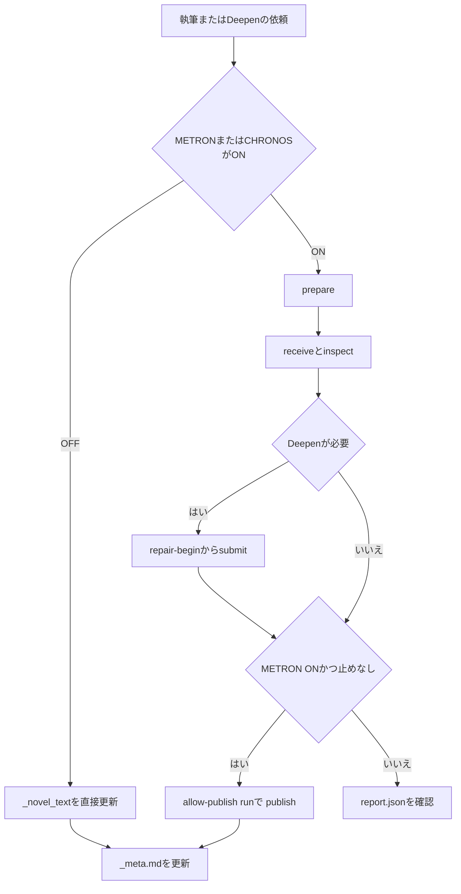

# Writing bridge の局所修復と本文反映

このガイドを読むと、計測済みの作業稿をファイル受け渡しで修復し、同じ本文版の検査を確認したうえで、本文正本 `_novel_text` へ場面単位で反映できます。CLIは外部APIを呼びません。

## このドキュメントを使う場面

1. **どんな場面で使うか** — 作品の `config.md` で METRON または CHRONOS が ON のとき、続きの執筆・場面の Deepen・当該場面の正本保存をチャットで依頼する。両方 OFF の作品では接続 run を作りません。
2. **チャットへの指示文** — これだけで動きます。
   - `第1章を執筆してください。`
   - `この場面をDeepenしてください。`
   - `当該場面を保存してください。`（METRON ON では省略できます）
3. **Monogatari Coach が行うこと** — フラグを読み、経路を一つ選びます。ON なら `prepare` → 候補の `receive` / `inspect`。Deepen は `repair-*`。METRON ON の場面作業では、修復が床到達したら `--allow-publish` の run で `publish --dry-run` のあと `publish` まで進みます。止めたいときはその旨を書いてください。CHRONOS ON だけでは正本へ書きません。その後 `_meta.md` のストーリー反映は別スキルです。
4. **ユーザーが確認できるもの** — `_writing/<scene>/<run>/` の `report.json`、`jobs/` のプロンプト、`_metron/<scene>/` の計測、反映後の `_novel_text` と `_novel_text_backup`。

清書（rewrite.md）は従来どおり別手順です。明示した `metron_cli.py` / `chronos_cli.py` はフラグ OFF でも拒否しません。

## 使う場面（技術）

「この場面をDeepenしてください」と対象を指定すると、Monogatari Coach は依頼範囲を確認し、契約・Beat・人物状態を修復文脈へ渡します。現在の生成モデルに承認済みのMETRON校正がある場合に利用できます。校正のないモデルはV0計測までとし、別モデルの校正を借りません。

ユーザーは `_writing/<scene>/<run>/jobs/` のプロンプト、`repair_state.json` の試行履歴、`report.json` の計測・C1結果を確認できます。作業稿と計測結果は `_metron/<scene>/` に残ります。CLIは外部APIを呼びません。

## 操作手順

先に通常の `prepare → receive → inspect` を実行します。正本へ反映する run は `prepare --allow-publish` が必要です。両検査がONならCHRONOSの文脈も取り込みます。METRON OFFでは修復を開始できません。本文を既に正本へ保存して初期ハッシュが変わったrunは再利用せず、新runを準備します。

`prepare` が書く `context.md` には、シーンと Beat の検査下限と、床以上の指示目標が並びます。指示目標は助言であり、未達だけでは検査を `TooShort` にしません。この表示は新しい `prepare` から有効です。既存 run の古い `instruction_chars` は現行の倍率ではありません。

以下はコマンドの書式例です。`MODEL_ID` は実際の生成元と一致する校正済みモデルIDへ置き換えます。`--authorization` は既存の修復依頼の出典・対象範囲を記録する欄で、文字列を指定するだけで外部課金や正本更新を許可するものではありません。

修復状態を開始し、次のジョブを取得します。

```powershell
# 指定場面の修復依頼を記録する。本文正本は更新しない。
python tools/writing_bridge_cli.py repair-begin novels/NNN_作品名 --scene-id ch01-001 --run-id run-0001 --model MODEL_ID --authorization "ユーザー依頼: 第1章の当該場面をDeepen"
# ジョブのプロンプトをファイルへ出して終了する。生成は行わない。
python tools/writing_bridge_cli.py repair-next novels/NNN_作品名 --scene-id ch01-001 --run-id run-0001
```

`jobs/JOB-0001.json` と `jobs/JOB-0001.prompt.md` が作成されます。エージェントがそのプロンプトを読んで候補を書きます。Deepen・再生成は対象Beatの本文を返し、結合校正は全Beatのマーカーを残します。結合校正の残存率と短縮検査は、マーカーを外した全文ではなく、実際に採用するBeat結合本文に対して行います。生成打切り（`length` / `max_tokens`）は、候補本文のハッシュが一致する metrics / generation からのみ引き継ぎます。同じ文字数の別候補へは継承しません。打切りは欠落Beatがあっても自動修復せず、`regenerate` も出しません。`receive --finish-reason` でその版の来歴を明示できます。修復の現在候補は、受領済みの最新出力です。出力ファイルは残っているが receive が完了していないときは開始稿のまま再開できます。受領後に開始稿を戻すと版競合になります。

候補を読み直し、出来事・視点・結末・人物状態を維持していると確認した場合に結果を提出します。

```powershell
# confirmed は意味のレビュー済みという申告。数値検査とは別に記録する。
python tools/writing_bridge_cli.py repair-submit novels/NNN_作品名 --scene-id ch01-001 --run-id run-0001 --job-id JOB-0001 --model MODEL_ID --candidate path/to/candidate.md --review confirmed
```

未確認時は `--review unverified`、意味の変更があれば `--review rejected` を指定します。候補は履歴に残り、修復稿には適用しません。短縮・同文・残存率不足・高類似の反復・マーカー不正は共通の検証処理が棄却します。

結果が失われたジョブは、自動で生成し直さず、明示的に失敗を確定できます。

```powershell
# candidate の代わりに、結果が得られなかった理由を指定する。
python tools/writing_bridge_cli.py repair-submit novels/NNN_作品名 --scene-id ch01-001 --run-id run-0001 --job-id JOB-0001 --model MODEL_ID --error "生成結果を取得できなかった"
```

受領後は作業稿が再計測されます。本文版が変わったら旧observationsを `observations_history/` へ退避し、新版は未確認に戻します。新しい作業稿を読み直し、その版の引用・座標・ハッシュでobservationsを作ります。

新しい根拠を検査し、次のジョブまたは完了状態を確認します。

```powershell
# 修復後の本文に対応するC1根拠を指定する。
python tools/writing_bridge_cli.py inspect novels/NNN_作品名 --scene-id ch01-001 --run-id run-0001 --observations path/to/new-observations.json
# 残るジョブがあれば同じ手順を繰り返す。
python tools/writing_bridge_cli.py repair-next novels/NNN_作品名 --scene-id ch01-001 --run-id run-0001
python tools/writing_bridge_cli.py status novels/NNN_作品名 --scene-id ch01-001 --run-id run-0001
```

`repair: completed` は修復の試行が終了した意味です。適格な追加候補が無くシーン床に届かないときは `repair: escalated` になります。必須修復も追加候補も無いときは、初回の `repair-next` から `pending` は空で、結合校正の job も出しません。どちらも METRON・C1 の成功や本文保存を意味しません。このあと新しい稿でやり直すときは、同じ run へ `receive` せず、新しい `prepare` の run を切ります。旧 run の observations や metrics は本文ハッシュが一致するときだけ `--from-run` で流用できます。`text_save` は `skipped` のままです。残る指摘は `report.json`、棄却・生成失敗・意味レビューは `repair_history` と `repair_state.json` で確認できます。修復の途中で C1 根拠がまだ無いときは、`status` に未記録として残りますがコマンドは失敗しません。完了後に根拠が無いときは従来どおり止まります。`status` の `metron_auto_repair: pending` は自動修復の対象が残っているとき、`none` は指摘だけが残っているときです。同じ受領候補を再度 `inspect` しても、計測ファイルの版は増えません。

## 本文正本への反映

`prepare` で `--allow-publish` を付けた run だけが正本へ書けます。権限の無い起草 run は `PERMISSION_DENIED` です。後から同じ run へ権限は付きません。METRON ON の作品では、執筆や Deepen の依頼だけで保存用 run まで進みます。CLI の `--allow-publish` は技術上の権限分離です。保存用の新しい run で候補の `receive` / `inspect` をやり直します。起草 run の本文 hash が一致する observations は `--from-run run-NNNN` で流用できます。指定元に `observations.json` が無いときは `UNKNOWN_REF` で止まり、保存先の旧根拠は使いません。run ID 以外の値や作品フォルダの外を指す値は拒否します。不一致は `STALE_EVIDENCE` です。CHRONOS が ON のときは C1 が成功するまで正本を書きません。`--authorization` は出典を記録する欄で、課金やイベント上書きの許可にはなりません。

反映内容を dry-run で確認してから実行します。次の `run-XXXX` は、この節の本番 `prepare --allow-publish` が返した id です。

```powershell
# 保存用 run を用意する。起草用 run の続きではない。
python tools/writing_bridge_cli.py prepare novels/NNN_作品名 --scene-id ch01-001 --text-path _novel_text/novel_text01.md --request-kind new --selector-kind heading --selector-value "章タイトル" --allow-publish --repo-root .
python tools/writing_bridge_cli.py receive novels/NNN_作品名 --scene-id ch01-001 --run-id run-XXXX --candidate path/to/marked.md
python tools/writing_bridge_cli.py inspect novels/NNN_作品名 --scene-id ch01-001 --run-id run-XXXX --from-run run-0001
# 正本は書き換えず、対象パスだけを表示する。
python tools/writing_bridge_cli.py publish novels/NNN_作品名 --scene-id ch01-001 --run-id run-XXXX --authorization "ユーザー依頼: 第1章の当該場面を保存" --dry-run --repo-root .
# 旧稿を _novel_text_backup へ退避し、対象場面だけを置換する。
python tools/writing_bridge_cli.py publish novels/NNN_作品名 --scene-id ch01-001 --run-id run-XXXX --authorization "ユーザー依頼: 第1章の当該場面を保存" --repo-root .
```

Monogatari Coach は Beat / fact マーカーを除いた本文を `_novel_text` へ書きます。マーカー行のあいだに残った連続空行は、段落1つ分（空行1つ）まで畳みます。対象外の場面は残します。既存の非空本文を `new` で反映するときは selector、当該場面の scene アンカー、または `append` が必要です。無い場合はファイル全体を置換しません。既存ファイルは `<元ファイル名>_vNNN.md` で退避します。`FINAL.md` は作りません。採用したマーカー稿は `_metron/<scene>/adopted.<run_id>.md` に残ります。

保存直後に同じ run で再計測します。`report.json` の `text_save` は `success`、`target_text_sha256` は保存本文です。METRON と C1 は採用した場面稿で測り、保存ファイルとハッシュが違うときは findings に残します。文字数と句読点ゲートも findings に記録します。句読点の失敗で本文は戻しません。`_meta.md` のストーリー反映と rewrite 清書は既存スキルの手順です。同じターンで `_novel_text` の手編集と `publish` は重ねません。



途中で失敗したときは候補と旧稿を残します。同じ `--authorization` で再開すると、本文が書けていれば検査から続け、二重退避しません。`publish_state.json` を書いたあとで正本が外部作成・削除・改変された場合は上書きせず `STALE_EVIDENCE` です。反映後に正本が変わっても同様です。修復が active のままでは publish できません。publish を始めた run へ別候補を `receive` することはできず、新しい run が必要です。`inspect --marked` は受領済み候補と同じ内容のパスだけを測ります。別内容を指定すると `STALE_EVIDENCE` です。

## 中断と再開

- `repair-next` の再取得は同じpendingジョブを返します。Deepenは同一Beat最大2回、再生成は最大1回、結合校正はrun全体で最大1回です。空出力・失敗も1回です。
- 同一jobの同じ結果の再提出は試行を増やしません。候補・失敗理由・意味レビューを変更して同じjobへ提出すると `JOB_CONFLICT` になります。
- 本文・契約・人物初期値・links・校正などが途中で変わると `STALE_EVIDENCE` になります。新runで準備し直します。発行済みプロンプトの書換えも拒否します。
- 状態は原子的に保存し、scene単位のOSロックで同時更新を拒否します。プロセスが終了するとロックは解放されます。確定後に成果物出力が中断した場合は `repair-next` で復旧できます。

## 実装境界

`metron.repair_steps` の `begin_repair / next_job / submit_result` はシリアライズ可能な状態を扱います。確定履歴を純粋な修復処理へ再投入し、次の未確定ジョブで即座に停止します。過去の生成を再実行しません。`repair_scene` も同じAPIを同期駆動します。

ジョブのprompt_hashは共通文脈・場面契約・修復時の全Beat本文を含む実際のプロンプト全体のSHA-256です。試行予約・結果確定とファイル出力は段階を分けて保存します。本文の意味の判断はエージェントに依存し、C1は記録した引用と状態値を検証します。自動抽出と外部providerは本工程に含めません。
