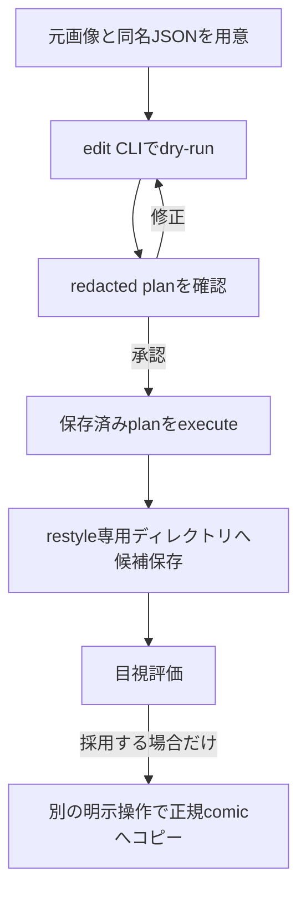

# 既存画像のImage2Imageリライト

このガイドを読むと、既存のPNG/JPEGを元画像としてNovelAI V4.5で絵柄をリライトし、元画像を残したまま候補を比較できます。

## この機能を使う場面

既存の漫画コマや一枚絵の構図・人物・小物を保ちながら、線・塗り・色調を保存済みのポーション（Vibe Transfer参照）へ寄せたいときに使います。通常のtxt2imgとは入口が分かれており、既存画像を入力にする処理は `tools/image_provider_edit.py` を使います。

チャットで依頼する場合は、次のように対象と条件を短く指定します。

```text
既存コマをNovelAI V4.5のImage2Imageで絵柄リライトしてください。
対象はこの一覧、ポーションはcross_flat、strengthは0.50、まずdry-runだけにしてください。
```

Monogatari Coach は、元画像・同名JSONの許可されたプロンプト・指定ポーションを計画へまとめ、ネットワーク送信なしのdry-runを作成します。ユーザーが計画を確認してから、明示的に本番実行します。

## 処理の流れ



`--dry-run` を先に行うのは、画像APIへの送信と課金が発生する前に、入力・プロンプト・モデル・寸法・保存先を確認するためです。

## 事前に用意するもの

- リポジトリの `.env` に `NOVELAI_ACCESS_TOKEN` を設定します。トークンはチャットやJSONへ貼りません。
- 元画像はPNGまたはJPEGにします。RGBA画像は通常 `--alpha-background white` を明示して作業用RGBへ合成します。`#RRGGBB` も構文上は指定できますが、白以外の品質は未検証です。元画像は変更されません。
- 元画像と同名のJSONがある場合、自動取得するのは文字列の `prompt` と `negative_prompt` だけです。旧モデル、seed、Vibe、寸法は引き継ぎません。漫画コマJSONでは `best quality` / `best_quality` などの品質語の重複や `summary_en` 由来の長い要約が残ることがあります。自動清掃はしないため、`quality_toggle=false` の場合も dry-run の実効promptを目視し、必要なら `--prompt` / `--prompt-file` で人手整理します。
- Vibe Transferを使う場合は、作品の `_meta.yaml` にあるIDを `--novel` と `--portion` で指定します。明示したportionが解決できない場合、別portionへ自動切替しません。
- ポーションを使わず元画像だけを再描画する場合は、参照なしを明示するため `--no-style-reference` を付けます。参照指定を省略しただけでは停止します。

### provider-options の例

次の内容を任意のJSONファイル（例: `restyle-options.json`）として保存します。`strength` のrestyle既定値は現在 `0.50` です。明示した値は既定値より優先されます。

```json
{
  "strength": 0.50,
  "noise": 0,
  "quality_toggle": false
}
```

`strength` は元画像からの変化量です。値を上げるほど絵柄は変わりやすくなりますが、顔・衣装・構図も再解釈されやすくなります。`noise` は別の設定で、比較時はまず `0` に固定します。

## 1枚だけ試す

元画像1枚を、標準ポーション付きで計画します。`--output-dir` に `_restyle` がない場合は自動的に付加されます。

```powershell
# --input: 元画像。--model: restyle先のV4.5モデル
# --novel/--portion: 作品と厳密に解決するポーションID
# --alpha-background: RGBAを白背景へ合成。元画像は変更しない
# --dry-run: 保存計画だけを作り、APIへ送信しない
python tools/image_provider_edit.py `
  --input novels/NNN_作品名/manga/_assets/manga_01/comic/source.png `
  --model v4-5-full `
  --novel novels/NNN_作品名 `
  --portion cross_flat `
  --alpha-background white `
  --provider-options restyle-options.json `
  --output-dir novels/NNN_作品名/manga/_assets/manga_01/comic `
  --dry-run
```

dry-runの出力に表示される `_restyle/<run_id>/restyle_plan.json` を確認します。計画には元画像hash、前処理済みhash、実効prompt、Vibe参照のhash、strength、noise、モデル、`sendable` が含まれます。画像base64、Vibe encoding、認証ヘッダーはredactされます。

ポーションなしを試す場合は、上の `--novel` / `--portion` を指定せず、代わりに `--no-style-reference` を明示します。その他の確認と実行手順は同じです。

参照なしの計画を作る場合は、次のように `--no-style-reference` を付けてdry-runします。

```powershell
python tools/image_provider_edit.py `
  --input novels/NNN_作品名/manga/_assets/manga_01/comic/source.png `
  --model v4-5-full `
  --no-style-reference `
  --output-dir novels/NNN_作品名/manga/_assets/manga_01/comic `
  --dry-run
```

承認後、dry-runで保存された同じ計画だけを実行します。

```powershell
# --plan: 承認したdry-run計画。execute時に入力・参照hashを再検証する
python tools/image_provider_edit.py `
  --execute `
  --plan novels/NNN_作品名/manga/_assets/manga_01/comic/_restyle/<run_id>/restyle_plan.json
```

候補と `restyle_run.json` は同じrunディレクトリに保存され、採用状態は `unadopted` です。正規の `comic/` へコピーする処理は別途明示します。

## 複数画像を1回のbatchにまとめる

複数コマを同じ条件で処理する場合は、`--batch` を付けて `--input` を画像ごとに繰り返します。1回のbatchにつき `_restyle/<batch_id>/` を1つだけ作り、その中に各コマの計画・前処理画像・候補・manifestを保存します。

```powershell
# --batch: 複数画像を1つのbatchディレクトリへまとめる
# --input: 対象画像を必要な数だけ繰り返す。stemは重複させない
# --provider-options: strength/noiseなどをbatch全体へ適用する
python tools/image_provider_edit.py `
  --batch `
  --input novels/NNN_作品名/manga/_assets/manga_01/comic/p01_k01.png `
  --input novels/NNN_作品名/manga/_assets/manga_01/comic/p01_k02.png `
  --model v4-5-full `
  --novel novels/NNN_作品名 `
  --portion cross_flat `
  --alpha-background white `
  --provider-options restyle-options.json `
  --output-dir novels/NNN_作品名/manga/_assets/manga_01/comic `
  --dry-run
```

dry-run後は、出力された `batch_plan.json` の対象数、各itemの入力hash、`sendable=true`、`network_sent=false` を確認します。batchのexecuteは保存済み計画を再読込してから行います。

```powershell
# --batch-plan: 承認したbatch_plan.jsonだけを指定する
python tools/image_provider_edit.py `
  --batch `
  --execute `
  --batch-plan novels/NNN_作品名/manga/_assets/manga_01/comic/_restyle/<batch_id>/batch_plan.json
```

実行開始時に `batch_run.json` が `running` で作られ、itemごとに結果が更新されます。途中で失敗した場合は、成功済み・失敗・未送信のitemを `partial_failure` として保存して停止します。既に `batch_run.json`、候補、または結果manifestがある同じbatchを再executeして候補を上書きすることはできません。未送信分を処理する場合は、対象を確認して新しいdry-runを作ります。

`--prompt` と `--prompt-file` はbatch全体へ同じ内容を適用します。これらを指定しない場合は、各画像の同名JSONから `prompt` / `negative_prompt` だけを読みます。`--allow-transform` もbatch全体に対する寸法変換承認なので、寸法が異なる画像はbatchを分けます。

## 保存されるファイル

単画像は `_restyle/<run_id>/`、batchは `_restyle/<batch_id>/` に分かれて保存されます。

| ファイル | 内容 |
| --- | --- |
| `restyle_plan.json` | 単画像のredacted dry-run計画 |
| `prepared_source.png` | 単画像の明示したalpha合成や寸法変換後の作業画像 |
| `<source_stem>_restyle_<run_id>_candidate_01.png` | 単画像のprovider候補画像 |
| `<source_stem>_restyle_<run_id>_candidate_01.json` | 単画像候補の入力・設定・保存先・未採用状態 |
| `restyle_run.json` | 単画像の結果manifest |
| `batch_plan.json` | batch全体の対象一覧、入力hash、各itemのplanパス、送信状態 |
| `<source_stem>_restyle_plan.json` | コマごとのredacted dry-run計画 |
| `<source_stem>_prepared_source.png` | 明示したalpha合成や寸法変換後の作業画像 |
| `<source_stem>_restyle_<batch_id>_candidate_01.png` | providerから返った候補画像 |
| `<source_stem>_restyle_<batch_id>_candidate_01.json` | 候補の入力・設定・保存先・未採用状態 |
| `<source_stem>_restyle_run.json` | コマ単位の結果manifest |
| `batch_run.json` | batch全体の進行状態、成功・失敗・pending、採用状態 |

`_restyle/` は正規画像の探索対象から除外されます。元画像や作品IRは自動変更されません。

## この入口で行わないこと

- `image_provider_generate.py` の通常txt2img既定値を変更しません。
- V5＋Vibeへの自動切替、失敗時のprovider切替、タイムアウト後の無条件再送を行いません。
- 同名JSONからmodel、seed、旧画像、旧Vibe、寸法を一括流用しません。
- 再描画結果を次の入力へ自動連鎖しません。
- 候補を正規 `comic/`、IR、`cover.yaml` へ自動採用しません。

## 困ったとき

- **RGBAで停止する**: まず `--alpha-background white` を明示します。今回の品質検証は白合成だけです。`#RRGGBB` は構文上受け付けますが未検証で、寸法変換（letterbox）との併用は停止します。未指定で停止するのは、透過を暗黙に変換しないためです。
- **`sendable=false` になる**: 寸法変換案が未承認です。dry-runの変換内容を確認し、承認する場合だけdry-runを作り直します。
- **portionが見つからない**: `--portion` のIDと作品 `_meta.yaml` の参照ファイルを確認します。別のportionへ自動切替しません。
- **再executeが拒否される**: 同じbatchに実行記録または候補が残っています。上書きせず、未送信項目を確認して新しいdry-runを作ります。
