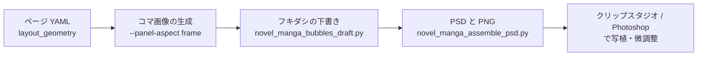

# 漫画のコマ画像を PSD に組む

このガイドを読むと、コマ単位で生成した画像をネームの枠へ収めた PSD（と同じ見た目の PNG）を作り、クリップスタジオ / Photoshop で仕上げられます。

## このドキュメントを使う場面

1. **どんな場面で使うか**
   - 漫画ページ YAML（`manga/pages/*.yaml`）に `layout_geometry`（ネームの枠）があり、コマ画像を `--source step1-panels` で作ったあと
   - ページ1枚の画像を生成するのではなく、コマごとの画像を並べて自分で仕上げたいとき
2. **チャットへの指示文**
   - これだけで動きます: 「manga_01 のコマを PSD に組んで」
   - Monogatari Coach は、フキダシの下書きと PSD の組み立てをそれぞれ dry-run で確認し、内容を報告してから書き出します。既存のファイルを置き換えるときは、前の版を退避してから置き換えます。
   - より詳細に指定したい場合: 「manga_01_p04 だけ、コマ1 は元画像の上寄り（横 50%・縦 20%）を見せて組み直して」
3. **Monogatari Coach が行うこと**
   1. （任意）枠の縦横比でコマ画像を生成する（NovelAI・課金の前に dry-run と承認）
   2. 台詞からフキダシの下書き `manga/pages/<page>.bubbles.yaml` を作る
   3. コマ画像・枠線・フキダシ・写植の目安を PSD と PNG に書き出す
4. **ユーザーが確認できるもの**
   - `manga/_assets/<manga_XX>/assembled/<page>_assembled.psd` と `.png`
   - 台詞の一覧 `<page>_lettering.txt`（写植の打ち直しに使う）
   - 前の版は `assembled/old/<実行日時>/`、前のフキダシの下書きは `manga/pages/_old/<実行日時>/`

## 全体の流れ



各段階は既定では計画を表示するだけで、`--apply` を付けたときだけ書き出します。確認してから実行する流れにしているのは、手で直したファイルや生成済みの画像を誤って置き換えないためです。

## 1. 枠の縦横比でコマ画像を作る（任意・NovelAI）

コマ画像は、枠を隙間なく埋める大きさで中央に置かれ、はみ出した分はクリッピングで隠れます。枠と同じ縦横比で生成すると、隠れる部分がほぼ無くなります。

`--panel-aspect frame` を付けると、`layout_geometry` の各枠の比率（B5 基準）からコマごとの画像サイズを決めます。まず dry-run で、コマごとのサイズ（`panel_frame`）を確認します。

```bash
# 確認（dry-run）— コマごとの枠の比率と、送るサイズを表示する
uv run python tools/image_provider_novel_manga_batch.py novels/114_作品名 \
  --manga-stem manga_01 --source step1-panels --provider novelai \
  --panel-aspect frame --dry-run

# 本番実行（課金の有無を確認してから）
uv run python tools/image_provider_novel_manga_batch.py novels/114_作品名 \
  --manga-stem manga_01 --source step1-panels --provider novelai \
  --panel-aspect frame
```

実行後、`manga/_assets/manga_01/comic/` に画像が保存され、生成 JSON に要求サイズと実際のサイズが記録されます。

- 対象は NovelAI の `step1-panels` だけです。`--aspect-ratio` / `--size` とは一緒に使えません（エラーになります）。
- サイズは `config/image_generation.json` の `novelai.panel_frame_sizes` で決まります。同梱の設定は `mode: pixel_budget` で、面積 1,048,576 画素以内・64 の倍数・辺 512〜1728 の範囲で比率に最も近いサイズを選びます。Opus プランで Anlas を消費しない条件を目安にしています（例: 576×1728 は 0 Anlas）。
- Opus プランの使用枠と Vibe の消費は、ツールでは確認しません。各自の NovelAI の画面で確認してください。
- 同じページに古いコマ画像が残っていると、PSD には最新の画像が選ばれます。古い画像は `comic/_old/` などへ移しておくと確実です。

## 2. フキダシの下書きを作る

ページ YAML の台詞と枠から、フキダシの位置の下書きを作ります。各コマの上側に右から左へ並べ、入りきらなければ下の段、それでも入らなければ文字を小さくします。しっぽはコマの中央やや下へ向けます。

```bash
# 確認（dry-run）— ページごとのフキダシの件数と種類、警告を表示する
uv run python tools/novel_manga_bubbles_draft.py novels/114_作品名 --manga-stem manga_01

# 書き出し
uv run python tools/novel_manga_bubbles_draft.py novels/114_作品名 --manga-stem manga_01 --apply

# 作り直す（前の下書きは manga/pages/_old/<実行日時>/ へ退避）
uv run python tools/novel_manga_bubbles_draft.py novels/114_作品名 --manga-stem manga_01 --apply --overwrite
```

実行後、`manga/pages/<page>.bubbles.yaml` ができます。先頭に「自動の下書き」と書かれます。

- 既にある `.bubbles.yaml` は、`--overwrite` を付けない限り触りません。手で直した下書きを守るためです。
- `text_mode: none`・台詞の無いページ・`layout_geometry` の無いページは対象外です。
- 位置としっぽの向きはあくまで下書きです。仕上げは編集ソフトで動かします。
- 下書きには、作ったときの台詞と枠の状態（`source`）が記録されます。あとでページの台詞や枠を変えると、手順3はそのページを書き出さずに止まります。古い位置のまま、写植の欠けた PSD ができるのを防ぐためです。

### フキダシの種類

台詞の種類で `bubble_type` が決まり、PSD での描き方が変わります。

| 台詞の種類 | `bubble_type` | PSD での描き方 |
|------------|---------------|----------------|
| 台詞（dialogue） | `speech` | 楕円としっぽ |
| 台詞で、`bubble_type` に `shout`・「叫」・「大声」などがある | `speech` | 叫び（ギザギザ） |
| 心の声（monologue） | `thought` | 楕円と小さな丸 |
| ナレーション（narration） | `narration` | 四角 |
| 効果音（sfx） | `sfx` | 枠なし（文字だけ） |

## 3. PSD と PNG に組む

まず dry-run で、使う画像・拡大率・はみ出しを確認します。

```bash
# 確認（dry-run）— コマごとの画像・倍率・はみ出し・写植の件数を表示する
uv run python tools/novel_manga_assemble_psd.py novels/114_作品名 --manga-stem manga_01

# 書き出し
uv run python tools/novel_manga_assemble_psd.py novels/114_作品名 --manga-stem manga_01 --apply

# 作り直す（前の版は assembled/old/<実行日時>/ へ退避。4つのファイルを一式で置き換え、途中で失敗したら前の版に戻す）
uv run python tools/novel_manga_assemble_psd.py novels/114_作品名 --manga-stem manga_01 --apply --overwrite
```

実行後、`manga/_assets/manga_01/assembled/` に次のファイルができます。

| ファイル | 内容 |
|----------|------|
| `<page>_assembled.psd` | 編集用の PSD（B5・既定 200dpi = 1433×2024） |
| `<page>_assembled.png` | PSD と同じ見た目の確認用 |
| `<page>_assembly.json` | 採用したコマ画像とハッシュ、見せる位置、警告、写植の設定 |
| `<page>_lettering.txt` | 台詞の一覧（番号は PSD のフキダシ番号と同じ） |

よく使うオプション:

- `--page manga/pages/manga_01_p04.yaml` 対象ページを絞る（複数可）
- `--reselect` コマ画像を作り直したあと、記録ではなく最新の画像を選び直す（置き換えるには `--overwrite` も要る）
- `--focus manga_01_p04:1=0.5,0.2` p04 のコマ1 で、元画像の横 50%・縦 20% の点を枠の中央へ寄せる。指定は記録に残り、次回も使われる
- `--max-scale 1.5` 拡大率がこれを超えたら警告する（拡大しすぎると実質の解像度が下がる。拡大は GraphAssist 側で行う予定）
- `--dpi 200` キャンバスの解像度
- `--font-mm 3.5` 写植の文字の大きさ（mm。3.5mm ≒ 14級・200dpi で 28px）。フキダシの下書きと同じ値にする
- `--font <パス>` 写植のフォント（既定は環境変数 `MONOCRI_LETTERING_FONT` → 游ゴシック Medium → Noto Sans JP → MS ゴシック）
- `--no-lettering` 写植と台詞の一覧を作らない
- `--no-name-ref` 非表示のネーム（参考）レイヤーを入れない

## PSD のレイヤー構成

上から順に次のとおりです。コマ画像と写植以外はロックされています。

| レイヤー | ロック | 内容 |
|----------|--------|------|
| ネーム（参考） | あり | 番号付きのネーム。非表示 |
| 写植 › フキダシ n › 文字 / 画像 | なし | 写植の目安（フキダシの絵と縦書きの文字）。効果音は「効果音 n」 |
| 枠線 | あり | コマの枠 |
| コマ n › 画像 | なし | コマ画像。下の土台にクリッピングされている |
| コマ n › 土台 | あり | 枠の形。これがクリッピングの範囲になる |
| 背景 | あり | 白 |

コマ画像は切り取らずに丸ごと入っています。編集ソフトでコマ画像を動かすと、枠の中の見え方だけが変わります。

## 編集ソフトについて

推奨はクリップスタジオ / Photoshop です。クリッピングとロックが効くことを確認しています。

- 写植は画像の目安で、編集できる文字ではありません。縦書きの文字ツールで `<page>_lettering.txt` の台詞を打ち直し、目安のレイヤーは非表示か削除にします。
- Affinity でも画像の調整はできますが、縦書きの文字に対応していないため、写植には向きません。

## うまくいかないとき

- **「拡大率が 1.5 を超えています」**: コマ画像が枠に対して小さすぎます。`--panel-aspect frame` で作り直すか、拡大は別のツールで行ってください。PSD は作られます。
- **写植が作られず、台詞の一覧だけができる**: そのページの `.bubbles.yaml` がありません。手順2を先に実行してください。
- **フォントが見つからない**: `--font` か環境変数 `MONOCRI_LETTERING_FONT` でフォントファイルを指定してください。見つからないときは台詞の一覧だけを書き出します。
- **「採用画像の中身が記録と違います」「記録された採用画像がありません」で止まる**: 記録にあるコマ画像が書き換わったか、移動しています。取り違えを防ぐために止めています。`--reselect --overwrite` で選び直してください。
- **「作ったあとで、ページの台詞か枠が変わっています」「ページの台詞と対応しません」で止まる**: フキダシの下書きが古くなっています。手順2を `--overwrite` 付きで実行して作り直してください（前の下書きは `manga/pages/_old/` に残ります）。手で直した位置は作り直すと消えるので、必要なら退避された下書きを見ながら直し直します。
- **「更新元（source）が無い」という警告**: 手で書いた下書きです。台詞との対応だけを確かめて書き出します。
- **既存のファイルがあるため触りません**: 置き換えるときは `--overwrite` を付けます。前の版は自動で退避されます。

## 関連ページ

- 漫画ページ YAML とコマ割りの型: [manga-prompt-ir.md](manga-prompt-ir.md)
- ページ画像への写植と領域合成: [manga-page-edit.md](manga-page-edit.md)
- 保存先のルール: [workflow-specification.md の「画像保存先」](../../.rulesync/rules/workflow-specification.md)
