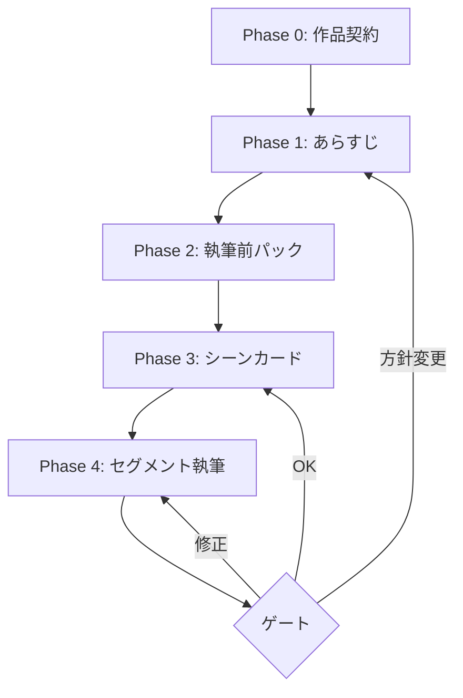

# チャットモード（対話型執筆方式）

このガイドを読むと、チャットモードで「会話しながら少しずつ書く」進め方と、TRPG セッション形式でパラメータを動かしながら進める方法がわかります。

---

## チャットモードとは

通常の Plan Mode がファイルを一括で揃えてから執筆するのに対し、チャットモードは「導入 → あらすじ → シーン → 執筆」を小さなゲートで繰り返しながら進めます。

**チャットモード ≠ 会話だけに書く。** 本文・設定の正本は従来どおり `novels/<作品>/` に保存されます。チャットは相談・合意・要約の場です。

会話の基本形は「選択肢から選ぶ」方式です。Monogatari Coach は物語の変化点や攻略・ゲーム性のある場面で、行動候補を最低2つと、状態確認・保存・中断・Other などのシステム系候補を最低1つ出します。もちろん、選択肢外の自由記述で指示しても構いません。

チャットで確定した物語の流れや攻略フラグは、逐語ログとしてではなく要約として `design_specification.md` に同期されます。これにより、あとから章・シーンの進行、採用された選択、未回収の伏線を俯瞰できます。

| 選ぶモード | 向いている状況 |
|------------|----------------|
| Plan Mode | 世界観・全章プロットを先に固めたい |
| **チャットモード** | 方向を見ながら少しずつ書きたい／連載で毎回ゲートを踏みたい |

---

## 始め方

### 最小限のトリガー文

```text
チャットモードで新規作品を始めたいです。
```

と入力すると、Monogatari Coach は自動的に Phase 0（作品契約）から始めます。

---

## Phase の流れ



### Phase 0: 作品契約

Monogatari Coach が読後感・主軸・トーン・尺感・結末の方向・禁止事項の6項目を確認します。合意した内容は `proposal.md` または `_meta.md` の「作品契約」節に保存されます。

### Phase 1: あらすじ

契約に基づき、10〜20行のビート列程度のあらすじを作ります。全章の詳細プロットは書きません。矛盾があれば確認が入ります。

確定したあらすじや章・シーンの流れは、必要に応じて `design_specification.md` に同期されます。

### Phase 2: 執筆前パック

`character.md`（ライト版）と `world.md`（アンカー版）を最小限の内容で揃えます。最初から百科全書にせず、シーンごとに追記して厚くします。

### Phase 3: シーンカード

今回書く1シーンだけを具体化します。「開始状態 → 変化 → 終了状態」と、読者に伝えたいこと1つを確認してから執筆に入ります。

同意したシーンカードは `_meta.md` に加えて、`design_specification.md` の該当章・該当シーンにも要約されます。

### Phase 4: セグメント執筆

シーン単位で執筆し、完了後にゲートを踏みます。

本文への反映後、セグメントで起きた出来事、選択結果、攻略フラグ、次の見通しが `design_specification.md` に同期されます。

| ゲート判定 | 次のアクション |
|----------|--------------|
| OK | 次のシーンカードへ |
| 修正 | 同じセグメントを清書 |
| 方針変更 | あらすじまたは作品契約へ戻る |

---

## 選択肢の見え方

選択肢は、主に「物語が変わる場面」と「攻略要素が動く場面」で出ます。

- 物語が変わる場面: 出会い、別れ、対立、秘密の開示、場所移動、シーンの節目
- 攻略要素が動く場面: リスク、時間制限、探索順、戦闘、交渉、好感度、フラグ、手がかり、パラメータ更新
- 制作上の合意ゲート: 作品契約、あらすじ、シーンカード、セグメント完了後の判断

実際の表示は、次のように番号で選べる形になります。

```text
次の行動を選べます。
1. 左の扉を開けて、音の正体を確かめる（危険だが手がかりが増える）
2. 机の下に隠れて、誰が来るか待つ（安全だが時間が進む）
3. 状態確認: 現在のパラメータを見る
4. Other: 別の行動を自由に指定する
```

作品契約やシーンカードの確認時は、「採用する」「調整する」「別案を見る」「Other」のように、編集判断として選べる形になります。

---

## 設計書への同期

`_chat/sessions/` には会話・セッションのログを残せます。一方で、`design_specification.md` には次の内容だけを要約して反映します。

- 章・シーンの流れ
- 採用された選択肢と、その結果
- 攻略フラグ、好感度、手がかり、未解決課題
- 次に書くシーンの見通し

長い会話文や GM 文の全文は入れず、あとから設計を見返したときに「今どこまで進んだか」が分かる粒度にします。

---

## TRPG セッション形式

「TRPG セッション形式で進めたい」と指示すると、Monogatari Coach が GM として物語を語り、パラメータをリアルタイムで追跡します。

### 始め方

```text
TRPGセッション形式で進めたいです。
```

または、Phase 2 の時点で次のように指示できます。

```text
この作品のルールブックを作ってください。
```

### Monogatari Coach が行うこと（Phase 2 完了後）

1. `proposal.md` / `world.md` / `character.md` を読んでジャンルを判断する
2. ジャンルに合ったパラメータ（好感度・成長段階・緊張度など）を選ぶ
3. 各パラメータの尺度・初期値・更新条件を定義した `_chat/rulebook.md` を作成する
4. ユーザーに確認を求める（承認前には次へ進まない）
5. 承認後に `_chat/state/char_state.md` と `_chat/state/world_state.md` を初期化する

### セッション中の見え方

GM（Monogatari Coach）の語りのあとに、パラメータの変化が `[STATE UPDATE]` ブロックとして表示されます。

```
---GM---
霧の中で二人が向き合った。リオンの声が、はじめて揺れた。

[STATE UPDATE]
リオン ← アイラ 関係値: 友好 6 → 8
緊張度: 中 → 高
第1章進行: 60% → 75%
```

### セッションを小説にする

セッション終了後、次のどちらかを選べます。

```text
このセッションログを小説として清書してください。
```

```text
このセッションのGM文体をそのまま_novel_textに保存してください。
```

---

## 確認できるファイル

| 操作 | 保存先 |
|------|--------|
| 作品契約 | `novels/<作品>/proposal.md` または `_meta.md` |
| あらすじ | `novels/<作品>/proposal.md` |
| ルールブック | `novels/<作品>/_chat/rulebook.md` |
| パラメータ現在値 | `novels/<作品>/_chat/state/char_state.md` |
| セッションログ | `novels/<作品>/_chat/sessions/chat_XX_YY.md` |
| 小説本文 | `novels/<作品>/_novel_text/novel_text*.md` |

---

## よく使うトリガー文

```text
チャットモードで新規作品を始めたいです。
```

```text
TRPGセッション形式で進めたいです。
```

```text
この作品のルールブックを作ってください。
```

```text
チャットモードで第1章の次のシーンを書いてください。
```

```text
今のセグメントはOKです。次のシーンカードを出してください。
```

```text
このセッションログを小説として清書してください。
```

---

詳細な仕様は [`.rulesync/skills/novel-chat-mode/SKILL.md`](../../.rulesync/skills/novel-chat-mode/SKILL.md) を参照してください。
