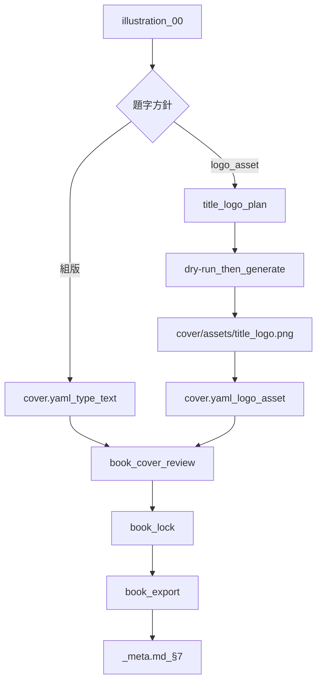

# 表紙合成・題字ロゴ（Cover Composition）

表紙**絵**（`illustration_00`）の上に題字・著者クレジットを載せ、`reader-proof.pdf` までつなぐ導線です。書誌は `book.yaml`、配置は `cover.yaml` が正本です。

印刷所向けの表1・背・表4の包み表紙と EPUB は対象外です。

## デフォルト方針（横タイトル主体・世界観AI連携）

1. **横書き（`horizontal`）既定**: ライトノベルや現代商業書籍のカバーデザインの標準に合わせて、明示指定がない限り**横書きタイトル（上部〜中央の横長帯など）**を主体として設計します。
2. **世界観情報の引き渡し**: 単に「文字を出力する」だけでなく、作品のテーマ・キーアイテム・カラー・トーンなどの世界観情報を抽出してAIプロンプト（`title_logo_order.yaml`）へ引き渡し、作品の雰囲気にマッチした題字デザインを生成させます。

## このドキュメントを使う場面

1. **どんな場面で使うか** — 表紙絵が生成済み（または計画済み）で、題字の載せ方を決め、閲覧用 proof まで出したいとき。
2. **チャットへの指示文** — 最小トリガーだけで動きます。
3. **Monogatari Coach が行うこと** — `_meta.md` の題字方針確認 → 組版または題字ロゴ計画 → `cover.yaml` → review → lock → export → §7 同期。
4. **ユーザーが確認できるもの** — `cover.yaml`、`cover/assets/`、`_publication_output/<build-id>/reader-proof.pdf`、`_meta.md` §3.1／§7。

## 最小トリガー

```
題字ロゴを計画してください。
```

```
表紙合成して proof を出してください。
```

```
cover.yaml を組版題字で整えてください。
```

詳細手順はスキル **title-logo-plan** / **novel-cover-layout** に従います。

## 題字方針（先に決める）

`_meta.md` §3.1 の **題字方針** を次のいずれかにする。

| 方針 | 意味 | 主な成果物 |
|------|------|------------|
| `組版` | `cover.yaml` の `type: text` で題字 | `cover.yaml` のみ |
| `logo_asset` | 生成ロゴPNGを後載せ | `cover/title_logo_plan.md` → `cover/assets/title_logo.png` → `logo_asset` |
| `後回し` | 表紙絵のみで一時停止 | proof の題字は未完成扱い |

どちらも同等に「題字完了」になり得ます（`後回し` 以外）。二重載せはしません。

## 標準フロー



## コマンド例

```bash
# 表紙レイアウト／権利の確認
python tools/book_cover_review.py novels/NNN_作品名 --target reader --gate writing

# 入稿前ゲート
python tools/book_review.py novels/NNN_作品名 --gate export --target paper
python tools/book_lock.py novels/NNN_作品名 --target paper

# 閲覧用 proof（layered cover）
python tools/book_export.py novels/NNN_作品名 --target paper --profile bunko --build-id cover-proof-1
python tools/book_preflight.py novels/NNN_作品名/_publication_output/cover-proof-1 --target paper
```

題字ロゴの画像生成は既存の image-provider 手順（`--dry-run` → 承認 → 本番）に従います。発注の構造化メモは `cover/title_logo_order.yaml`（雛形: `_how_to.example/publishing/title_logo_order.yaml.example`）。

## 完成目安（`_meta.md`）

- §3.1: 題字方針・題字ロゴ状態・表紙レイアウトパス
- §7: book / rights / cover.yaml / lock / interior / reader-proof / preflight

横断定義は `.rulesync/rules/concepts.md` の「表紙合成と題字」「出版完成目安」。

## 関連

- [Publishing Package](publishing-package.md)
- [紙書籍 proof PDF](paper-proof-export.md)
- [挿絵・表紙 IR](../image-generation/illustration-prompt-ir.md)
- 雛形: `_how_to.example/publishing/`
